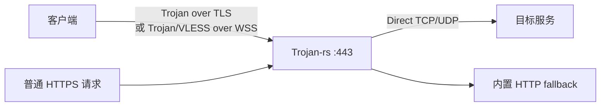
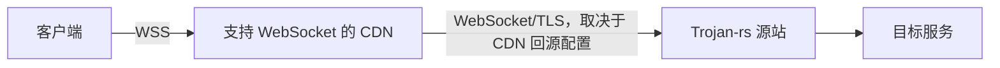

# Trojan-rs

Trojan-rs 是一个纯服务端的轻量代理实现，使用 Rust、Tokio 和 Rustls 构建。项目专注于提供 Trojan、VLESS 服务端支持，以及 WebSocket/WSS、UDP 转发和 Trojan-Go 风格的多路复用（Mux）。

> [!WARNING]
> 本项目仍处于实验性演进阶段，协议实现、配置格式和兼容性可能随版本变化。请在部署前完成互操作、容量和故障恢复测试。

## 声明与许可

本项目仅供合法的网络互联、安全测试和技术研究。使用者必须遵守所在地法律法规，并自行承担部署和使用责任。

项目采用 [GNU General Public License v3](LICENSE)。修改和再分发应遵守 GPLv3。

## 当前能力

| 层级 | 实现 |
| --- | --- |
| 入站代理 | Trojan；VLESS 服务端 |
| 传输 | 原生 TLS；WebSocket over TLS（WSS） |
| 出站 | Direct TCP/UDP |
| 多路复用 | Trojan-Go 风格 Mux，仅用于 Trojan |
| TLS | Rustls，支持 TLS 1.2/1.3 |
| HTTP fallback | 内置有限 HTTP/1.1 与 HTTP/2 路由，无需 nginx 或 Caddy |
| 平台 | CI 构建 Linux、Linux musl、Windows、macOS 的 x86_64/aarch64 目标 |

能力边界：

- 本项目**仅作为服务端运行**，不提供本地客户端（如 SOCKS5）功能。
- VLESS 服务端必须启用 WebSocket，并且不能与 `[trojan]` 同时配置。
- Mux 只支持 Trojan；VLESS 配置存在 `[mux]` 时会拒绝启动。
- 没有透明代理、规则路由、管理 API、流量统计或数据库。
- 没有浏览器 ClientHello 模拟、ECH、HTTP/3 或 QUIC。

## 协议栈

### 直接部署



没有 CDN 或反向代理时，客户端直接连接服务端。WSS 仍可提供标准 HTTP/1.1 Upgrade 外观，但源站 IP、连接持续时间、包长和流量方向仍然可被观察。

### CDN 部署



只有 WebSocket/WSS 传输适合普通 HTTP CDN。裸 Trojan/TLS 不是 HTTP 流量，通常不能通过标准 CDN 代理。CDN 能隐藏源站地址的前提还包括：源站防火墙只允许 CDN 回源地址、DNS 历史没有泄露、证书与回源 SNI 配置一致。

## 实现细节

### 异步 I/O 与转发

- Tokio 提供任务调度、异步 TCP/UDP、计时器和操作系统事件队列集成；Linux、macOS 和 Windows 分别使用相应的事件通知机制。
- TCP 转发使用 `tokio::io::copy_bidirectional_with_sizes`，当前双向缓冲区均为 16 KiB。
- UDP 通过项目内部的 `ProxyUdpStream`、`UdpRead` 和 `UdpWrite` 接口转发。
- release 配置启用 LTO、符号剥离、单 codegen unit 和 `panic = "abort"`。这些设置偏向较小体积和跨模块优化，但不承诺固定内存占用或零堆分配。

### TLS 整合：Rustls

项目已全面迁移至纯 Rust 实现的 `rustls` 以处理 TLS 会话，去除了原本对 BoringSSL 及 C/C++ 工具链（CMake、Clang）的依赖。这显著提升了跨平台编译体验和项目的安全性边界。

- 服务端启动时读取证书链和私钥、检查二者匹配，并使用证书验证配置的 `sni`。
- 服务端要求 `sni` 是有效 DNS 主机名：不能为空、不能是 IP、不能有结尾点号，标签长度和字符必须有效。
- 握手期间，服务端利用 `ResolvesServerCert` 仅接受与配置值（大小写无关）匹配的 SNI；缺失或错误 SNI 会中断握手。
- 服务端 TLS 握手超时默认均为 10 秒。

### WebSocket 握手与数据承载

WebSocket 使用 RFC 6455 的 HTTP/1.1 Upgrade 流程。服务端在交给 tungstenite 完整校验前，先限制请求头大小和握手时间，并检查：

- 方法必须为 `GET`；
- URI path 与配置路径相同，query 不参与 path 比较；
- 存在非空 `Host`；
- `Connection` 包含 `Upgrade`；
- `Upgrade` 包含 `websocket`；
- `Sec-WebSocket-Version` 为 `13`；
- 存在非空 `Sec-WebSocket-Key`。

隧道数据使用 WebSocket Binary message。Ping/Pong 由 WebSocket 层处理；文本消息被拒绝；关闭帧映射为隧道 EOF。

Trojan 与 VLESS 的入口行为不同：

- Trojan + WebSocket 使用 allow-raw 模式。同一 TLS 监听器可同时接受裸 Trojan 和 Trojan over WebSocket。
- VLESS 使用 strict 模式。未形成目标 WebSocket Upgrade 的 HTTP 请求进入 fallback；VLESS 不接受裸 TLS。

### API 与可视化面板

程序内置了一个实时监控面板和 JSON API。由于默认与主代理（443端口）使用同一个监听器，并且通过相同的 Fallback 机制处理，你只需通过 HTTPS 直接访问相应路径即可：

- `GET /api/status`: 会返回当前所有活动连接和全局统计的 JSON 数据，需要 `[fallback] dashboard_password` 鉴权。
- `GET /dashboard`: 返回内置的 HTML 可视化面板，需要 `[fallback] dashboard_password` 鉴权。

dashboard/API 使用 HTTP Basic Auth，用户名固定为 `admin`。未配置 `dashboard_password` 时，这两个路由返回 404，不对公网暴露管理信息。

如果未匹配这两个路径且未形成合法的代理握手，将回退处理：

fallback 是一个有限的 HTTP/1.0/1.1 与 HTTP/2 静态响应器，不是通用 Web 服务器。TLS 同时声明 `h2` 与 `http/1.1`：协商到 `h2` 的连接直接处理 fallback 路由，协商到 `http/1.1` 的连接继续进入现有 WSS/VLESS 链。它在独立 Tokio task 中执行，并受握手超时和最大页面大小约束：

- fallback 页面最大 2 MiB；
- HTTP/1.1 请求必须包含非空 `Host`；
- `GET /` 和 `GET /index.html` 返回配置页面；
- `GET /robots.txt` 返回内置文本；
- 未知路径返回 `404`；
- GET/HEAD 以外的方法返回 `405` 和 `Allow: GET, HEAD`；
- 不完整或不可解析的 HTTP 返回 `400`；
- `HEAD` 返回与 GET 相同的 Content-Length，但不发送 body；
- HTTP/1.1 响应使用 `Connection: close`；HTTP/2 可在同一连接上处理多个请求。当前不实现压缩、范围请求或动态资源。

如果输入的前四字节不像受支持的 HTTP 方法，fallback 不生成 HTTP 响应，直接关闭流。该行为只发生在 TLS 已建立、数据已进入代理协议识别之后。

### Trojan 鉴权

Trojan 首部使用 `hex(SHA-224(password))`、CRLF、命令、目标地址和 CRLF，随后承载 TCP payload 或 UDP 数据报。服务端逐步读取完整哈希，避免 TCP 分片被过早判定为失败。

鉴权或首部解析失败时：

- 配置了 fallback：已读取字节被交给 fallback；普通 HTTP 可获得伪装响应，非 HTTP 数据被关闭。
- 未配置 fallback：该连接返回协议错误并关闭。

### VLESS

当前 VLESS 仅实现服务端，支持标准 UUID 用户列表、TCP 和长度前缀 UDP。用户列表不能为空，UUID 必须有效且不能重复。VLESS 请求头默认必须在 10 秒内完成。

VLESS 必须运行在 strict WebSocket 入口之上。当前未实现 flow、XTLS Vision、REALITY。

启用 `[vless.multiplex]` 后，服务端支持 sing-box 的 multiplex 默认 `h2mux` 协议。sing-box 客户端应使用 `multiplex.enabled = true`，并保持 `protocol` 为空或显式设为 `h2mux`；`smux`、`yamux`、padding 和 brutal 暂不支持。

### Trojan-Go Mux

Mux 在一条底层 Trojan 连接上复用多个 TCP/UDP 逻辑流。服务端完整支持 Mux 流解析与调度。
是否启用应通过实际业务负载测试决定，不应默认认为它总能提升隐蔽性或性能。

## 配置

程序通过 TOML 配置启动：

```shell
trojan-rs -c config/server.toml
```

配置文件要求显式声明 `mode = "server"`。

### 示例：Trojan + 可选 WSS

```toml
mode = "server"
log_level = "info"

[trojan]
password = "replace-with-a-strong-random-password"

[tls]
addr = "0.0.0.0:443"
sni = "example.com"
cert = "/etc/trojan-rs/fullchain.pem"
key = "/etc/trojan-rs/private.key"
handshake_timeout_secs = 10

[fallback]
page = "/var/www/camouflage.html"
dashboard_password = "replace-with-a-strong-dashboard-password"
request_timeout_secs = 10
max_request_size = 8192

# 启用后，同一监听器同时接受裸 Trojan 与 Trojan over WSS。
# [websocket]
# path = "/api/events"
# handshake_timeout_secs = 10

# [mux]
```

### 示例：VLESS over WSS

```toml
mode = "server"
log_level = "info"

[vless]
users = ["d342d11e-d424-4583-b36e-524ab1f0afa4"]
handshake_timeout_secs = 10

[tls]
addr = "0.0.0.0:443"
sni = "example.com"
cert = "/etc/trojan-rs/fullchain.pem"
key = "/etc/trojan-rs/private.key"
handshake_timeout_secs = 10

[websocket]
path = "/api/events"

[fallback]
page = "/var/www/camouflage.html"
dashboard_password = "replace-with-a-strong-dashboard-password"
```

使用 VLESS 时不要同时配置 `[trojan]` 或 `[mux]`；Trojan 模式可以单独启用 `[mux]`。

## 构建

```shell
cargo build --release
```

由于移除了 BoringSSL，构建流程不再依赖 CMake、Clang 和 NASM。只需要标准的 Rust 工具链即可完成编译。

## 一键部署脚本

仓库包含 [`scripts/install.sh`](scripts/install.sh)，支持使用 systemd 或 OpenRC 管理服务。

```shell
wget https://raw.githubusercontent.com/tuxco-de/trojan-rs/main/scripts/install.sh
chmod +x install.sh
sudo ./install.sh
```

## 路线图

- [x] Tokio 异步 TCP/UDP 转发
- [x] Trojan、VLESS 服务端和 WebSocket 支持
- [x] 基于 Rustls 的原生 TLS 实现
- [x] 严格 SNI 和 TLS 握手超时
- [x] 有限 HTTP fallback 和 WebSocket 资源限制
- [x] 内置 Dashboard 与 API 指标查询
- [x] 代码结构优化，剔除客户端与 C/C++ 依赖，纯服务端转型
- [ ] 可复现的吞吐、延迟和内存 benchmark
- [ ] 更完整的端到端互操作测试

## 致谢

- [trojan-gfw/trojan](https://github.com/trojan-gfw/trojan)
- [rustls](https://github.com/rustls/rustls)
