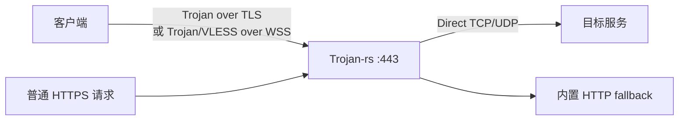
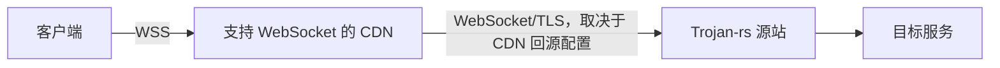

# Trojan-rs

Trojan-rs 是一个以服务端为重点的轻量代理实现，使用 Rust、Tokio 和静态链接的 BoringSSL。项目支持 Trojan、VLESS 服务端、Trojan 客户端、SOCKS5、本地直连出站、WebSocket/WSS、UDP 转发和 Trojan-Go 风格多路复用。

> [!WARNING]
> 本项目仍处于实验性演进阶段，协议实现、配置格式和兼容性可能随版本变化。请在部署前完成互操作、容量和故障恢复测试。

## 声明与许可

本项目仅供合法的网络互联、安全测试和技术研究。使用者必须遵守所在地法律法规，并自行承担部署和使用责任。

项目采用 [GNU General Public License v3](LICENSE)。修改和再分发应遵守 GPLv3。

## 当前能力

| 层级 | 实现 |
| --- | --- |
| 入站代理 | Trojan；VLESS 服务端 |
| 本地客户端入口 | SOCKS5 TCP、SOCKS5 UDP ASSOCIATE |
| 传输 | 原生 TLS；WebSocket over TLS（WSS） |
| 出站 | Direct TCP/UDP |
| 多路复用 | Trojan-Go 风格 Mux，仅用于 Trojan |
| TLS | BoringSSL，最低 TLS 1.2，支持 TLS 1.3 |
| HTTP fallback | 内置有限 HTTP/1.1 路由，无需 nginx 或 Caddy |
| 平台 | CI 构建 Linux、Linux musl、Windows、macOS 的 x86_64/aarch64 目标 |

能力边界：

- 内置客户端只实现 Trojan，不实现 VLESS 客户端。
- VLESS 服务端必须启用 WebSocket，并且不能与 `[trojan]` 同时配置。
- Mux 只支持 Trojan；VLESS 配置存在 `[mux]` 时会拒绝启动。
- 没有透明代理、规则路由、管理 API、流量统计或数据库。
- 没有浏览器 ClientHello 模拟、uTLS/craftls 模板、ECH、HTTP/2、HTTP/3 或 QUIC。
- BoringSSL 并不自动使 TLS 握手等同于 Chrome，也不能保证规避 JA3/JA4 或其他流量分类。

## 协议栈

### 直接部署



没有 CDN 或反向代理时，客户端直接连接服务端。WSS 仍可提供标准 HTTP/1.1 Upgrade 外观，但源站 IP、连接持续时间、包长和流量方向仍然可被观察。

### CDN 部署



只有 WebSocket/WSS 传输适合普通 HTTP CDN。裸 Trojan/TLS 不是 HTTP 流量，通常不能通过标准 CDN 代理。CDN 能隐藏源站地址的前提还包括：源站防火墙只允许 CDN 回源地址、DNS 历史没有泄露、证书与回源 SNI 配置一致。

## 实现细节

### 异步 I/O 与转发

- Tokio 提供任务调度、异步 TCP/UDP、计时器和操作系统事件队列集成；Linux、macOS 和 Windows 分别使用相应的事件通知机制。
- TCP 转发使用 `copy_bidirectional_with_sizes`，当前双向缓冲区均为 16 KiB。
- UDP 通过项目内部的 `ProxyUdpStream`、`UdpRead` 和 `UdpWrite` 接口转发。
- `#![forbid(unsafe_code)]` 禁止项目自身使用 unsafe Rust；依赖库和 BoringSSL 的底层实现不受该属性约束。
- release 配置启用 LTO、符号剥离、单 codegen unit 和 `panic = "abort"`。这些设置偏向较小体积和跨模块优化，但不承诺固定内存占用或零堆分配。

### BoringSSL 与链接方式

TLS 通过 `boring` 和 `tokio-boring` 接入 Tokio。`boring-sys` 在构建时编译 BoringSSL，并把 `crypto`/`ssl` 静态库链接进可执行文件，因此部署端不需要额外安装 OpenSSL、libssl 或 libcrypto。

这不表示程序完全无动态依赖：例如 Windows 构建仍可能依赖系统 C/C++ 运行库，具体以目标工具链和产物检查结果为准。BoringSSL 官方也明确不承诺稳定 API/ABI，因此依赖升级必须经过重新构建和互操作测试。

### TLS 版本、证书与信任根

- 客户端和服务端最低允许 TLS 1.2；TLS 1.3 由 BoringSSL 默认策略协商。
- 服务端启动时读取证书链和私钥、检查二者匹配，并使用叶证书验证配置的 `sni`。
- 服务端要求 `sni` 是 DNS 主机名：不能为空、不能是 IP、不能有结尾点号，标签长度和字符必须有效。
- TLS 握手期间，服务端仅接受与配置值大小写无关匹配的 SNI；缺失或错误 SNI 使用 `unrecognized_name` 致命告警终止握手。
- 客户端使用同一个 `sni` 发送 Server Name Indication，并执行证书主机名校验。
- 未配置 `cert` 时，客户端使用 `webpki-root-certs` 提供的嵌入式 Mozilla 信任根，不读取操作系统证书库。
- 配置客户端 `cert` 后，仅把该 PEM 文件中的证书加入本次连接使用的信任存储。
- 客户端和服务端 TLS 握手超时默认均为 10 秒，值为 0 会被拒绝。

服务端的 `sni`、证书 SAN 和客户端连接域名必须一致。使用 CDN 时，还需要让 CDN 回源握手发送同一 SNI。

### ALPN 策略

ALPN 遵循 RFC 7301，用于在 TLS 握手中声明上层协议：

- Trojan 客户端使用裸 TLS 时不发送 ALPN，避免声明 HTTP 后发送非 HTTP 数据的跨层不一致。
- 配置 WebSocket 时，客户端仅发送 `http/1.1`。
- 服务端只在客户端提供 `http/1.1` 时选择它；裸 Trojan 客户端不提供 ALPN 时，服务端不协商 ALPN。
- 当前没有 HTTP/2 实现，因此不会声明 `h2`。

### 密码套件配置

一般建议保留 BoringSSL 默认值。`cipher` 仅覆盖 TLS 1.2 密码套件，并只接受以下 IANA 名称：

```text
TLS_ECDHE_ECDSA_WITH_CHACHA20_POLY1305_SHA256
TLS_ECDHE_RSA_WITH_CHACHA20_POLY1305_SHA256
TLS_ECDHE_ECDSA_WITH_AES_256_GCM_SHA384
TLS_ECDHE_ECDSA_WITH_AES_128_GCM_SHA256
TLS_ECDHE_RSA_WITH_AES_256_GCM_SHA384
TLS_ECDHE_RSA_WITH_AES_128_GCM_SHA256
```

BoringSSL Rust 接口不提供本项目所需的 TLS 1.3 套件覆盖能力；配置以 `TLS13_` 开头的名称会直接报错。

### TLS 指纹说明

当前实现使用 BoringSSL 原生握手，不维护浏览器版本模板，也不随机排列扩展或密码套件。BoringSSL 同样用于 Chromium，并不意味着任意 BoringSSL 应用会产生 Chromium 的 ClientHello：构建版本、API 配置、扩展、ALPN、会话恢复和应用层行为都会影响可观测特征。

JA4 会从 TLS ClientHello 的版本、密码套件、扩展、ALPN 等字段生成指纹。因此本项目的目标是减少明显的跨层矛盾，而不是声称 TLS 指纹不可识别。升级 BoringSSL 后应通过抓包回归检查 ClientHello、ServerHello、ALPN、证书链和 JA4/JA4S 变化。

### WebSocket 握手与数据承载

WebSocket 使用 RFC 6455 的 HTTP/1.1 Upgrade 流程。服务端在交给 tungstenite 完整校验前，先限制请求头大小和握手时间，并检查：

- 方法必须为 `GET`；
- URI path 与配置路径相同，query 不参与 path 比较；
- 存在非空 `Host`；
- `Connection` 包含 `Upgrade`；
- `Upgrade` 包含 `websocket`；
- `Sec-WebSocket-Version` 为 `13`；
- 存在非空 `Sec-WebSocket-Key`。

默认资源限制：

| 配置 | 默认值 | 约束 |
| --- | ---: | --- |
| `handshake_timeout_secs` | 10 | 必须大于 0 |
| `max_handshake_size` | 8192 | 服务端至少 256 字节 |
| `read_buffer_size` | 16384 | 必须大于 0 |
| `write_buffer_size` | 16384 | tungstenite 写缓冲目标值 |
| `max_message_size` | 1048576 | 必须大于 0 |
| `max_frame_size` | 1048576 | 不得大于 message 限制 |
| `max_write_buffer_size` | 2097152 | 必须大于 write buffer |

隧道数据使用 WebSocket Binary message。Ping/Pong 由 WebSocket 层处理；文本消息被拒绝；关闭帧映射为隧道 EOF。

Trojan 与 VLESS 的入口行为不同：

- Trojan + WebSocket 使用 allow-raw 模式。同一 TLS 监听器可同时接受裸 Trojan 和 Trojan over WebSocket。
- VLESS 使用 strict 模式。未形成目标 WebSocket Upgrade 的 HTTP 请求进入 fallback；VLESS 不接受裸 TLS。

WebSocket path 只是路由条件，不是认证凭据。安全性仍依赖 Trojan 密码或 VLESS UUID、TLS 私钥和正确的访问控制。

### 内置 HTTP fallback

fallback 是一个有限的 HTTP/1.0/1.1 静态响应器，不是通用 Web 服务器。它在独立 Tokio task 中执行，并受请求读取超时、最大请求头和最大页面大小约束：

- fallback 页面最大 2 MiB；
- HTTP/1.1 请求必须包含非空 `Host`；
- `GET /` 和 `GET /index.html` 返回配置页面；
- `GET /robots.txt` 返回内置文本；
- 未知路径返回 `404`；
- GET/HEAD 以外的方法返回 `405` 和 `Allow: GET, HEAD`；
- 不完整或不可解析的 HTTP 返回 `400`；
- `HEAD` 返回与 GET 相同的 Content-Length，但不发送 body；
- 响应包含 `Server: nginx`、`Date`、`Content-Type`、`Content-Length`、缓存策略和 `X-Content-Type-Options`；
- 所有响应使用 `Connection: close`，当前不实现 keep-alive、压缩、范围请求或动态资源。

如果输入的前四字节不像受支持的 HTTP 方法，fallback 不生成 HTTP 响应，直接关闭流。该行为只发生在 TLS 已建立、数据已进入代理协议识别之后；TLS 握手本身失败时由 BoringSSL 返回对应 TLS 行为。

固定 `Server: nginx` 只是响应外观，不代表实现了 nginx 的完整协议行为。需要更高一致性时，应使用独立真实站点或反向代理，但这不属于轻量内置 fallback 的范围。

### Trojan 鉴权

Trojan 首部使用 `hex(SHA-224(password))`、CRLF、命令、目标地址和 CRLF，随后承载 TCP payload 或 UDP 数据报。服务端逐步读取完整哈希，避免 TCP 分片被过早判定为失败。

鉴权或首部解析失败时：

- 配置了 fallback：已读取字节被交给 fallback；普通 HTTP 可获得伪装响应，非 HTTP 数据被关闭。
- 未配置 fallback：该连接返回协议错误并关闭。

### VLESS

当前 VLESS 仅实现服务端，支持标准 UUID 用户列表、TCP 和长度前缀 UDP。用户列表不能为空，UUID 必须有效且不能重复。VLESS 请求头默认必须在 10 秒内完成。

VLESS 必须运行在 strict WebSocket 入口之上。当前未实现 flow、XTLS Vision、REALITY 或 VLESS 客户端，因此与第三方客户端互操作时应使用基础 VLESS + WS + TLS 配置。

### Trojan-Go Mux

Mux 在一条底层 Trojan 连接上复用多个 TCP/UDP 逻辑流。客户端 `concurrent` 表示单个底层连接允许的最大已建立逻辑流数量，必须至少为 2；当现有连接达到上限时会创建新的底层连接。

Mux 可以减少频繁建连和 TLS 握手，但长连接、多流突发和队头阻塞也可能影响流量形态与延迟。是否启用应通过实际业务负载测试决定，不应默认认为它总能提升隐蔽性或性能。

## 配置

程序通过 TOML 配置启动：

```shell
trojan-rs -c config/server.toml
```

完整模板位于 [`config/server.toml`](config/server.toml)、[`config/client.toml`](config/client.toml) 和 [`config/forward.toml`](config/forward.toml)。当前主程序实现的运行模式是 `server` 和 `client`。

### 服务端示例：Trojan + 可选 WSS

```toml
mode = "server"
log_level = "info"

[trojan]
password = "replace-with-a-strong-random-password"

[tls]
addr = "0.0.0.0:443"
sni = "example.com"
cert = "/etc/trojan-rs/fullchain.pem"
key = "/etc/trojan-rs/private.key"
handshake_timeout_secs = 10

[fallback]
page = "/var/www/camouflage.html"
request_timeout_secs = 10
max_request_size = 8192

# 启用后，同一监听器同时接受裸 Trojan 与 Trojan over WSS。
# [websocket]
# path = "/api/events"
# handshake_timeout_secs = 10
# max_handshake_size = 8192
# read_buffer_size = 16384
# write_buffer_size = 16384
# max_message_size = 1048576
# max_frame_size = 1048576
# max_write_buffer_size = 2097152

# [mux]
```

### 服务端示例：VLESS over WSS

```toml
mode = "server"
log_level = "info"

[vless]
users = ["d342d11e-d424-4583-b36e-524ab1f0afa4"]
handshake_timeout_secs = 10

[tls]
addr = "0.0.0.0:443"
sni = "example.com"
cert = "/etc/trojan-rs/fullchain.pem"
key = "/etc/trojan-rs/private.key"
handshake_timeout_secs = 10

[websocket]
path = "/api/events"

[fallback]
page = "/var/www/camouflage.html"
```

使用 VLESS 时不要同时配置 `[trojan]` 或 `[mux]`；Trojan 模式可以单独启用 `[mux]`。

### Trojan 客户端示例

```toml
mode = "client"
log_level = "info"

[socks5]
addr = "127.0.0.1:1080"

[trojan]
password = "replace-with-a-strong-random-password"

[tls]
addr = "example.com:443"
sni = "example.com"
handshake_timeout_secs = 10
# cert = "/path/to/custom-ca.pem"
# cipher = ["TLS_ECDHE_RSA_WITH_AES_128_GCM_SHA256"]

# 服务端启用 WebSocket 时取消注释。
# [websocket]
# uri = "wss://example.com/api/events"
# handshake_timeout_secs = 10

# [mux]
# concurrent = 8
```

客户端 `addr` 可以解析到 IP，但 `sni` 必须是证书覆盖的 DNS 名称。自定义 `cert` 是 PEM CA/信任证书文件，不是关闭证书验证的开关。

## 构建

### 本机构建

```shell
cargo build --release
```

只构建单一角色可减小功能集合：

```shell
cargo build --release --no-default-features --features server
cargo build --release --no-default-features --features client
```

BoringSSL 在构建阶段编译。构建机需要：

- Rust stable 工具链；
- CMake；
- Clang 和可被 bindgen 找到的 libclang；
- 目标平台 C/C++ 编译器；
- x86/x86_64 目标通常还需要 NASM。

Ubuntu/Debian 示例：

```shell
sudo apt-get install -y build-essential cmake clang libclang-dev ninja-build nasm
cargo build --release
```

Windows 示例依赖 Visual Studio Build Tools、CMake、LLVM/libclang 和 NASM。必要时设置：

```powershell
$env:LIBCLANG_PATH = "C:\Program Files\LLVM\bin"
cargo build --release
```

CI 发布流程分别构建 client/server，并生成 Linux glibc、Linux musl、Windows 和 macOS 产物。BoringSSL 构建时间明显长于纯 Rust 依赖，首次编译属于正常现象。

## 一键部署脚本

仓库包含 [`scripts/install.sh`](scripts/install.sh)，支持使用 systemd 或 OpenRC 管理服务，并可调用 acme.sh 完成手动 DNS-01 证书流程。脚本支持 Debian/Ubuntu、RHEL/CentOS/Fedora 和 Alpine 系包管理器。

```shell
wget https://raw.githubusercontent.com/tuxco-de/trojan-rs/main/scripts/install.sh
chmod +x install.sh
sudo ./install.sh
```

运行远程脚本前应先检查内容，并确认发布资产、域名、证书路径、防火墙和服务账户符合部署要求。

## 工程演进与踩坑记录

本节根据仓库提交历史和当前 BoringSSL 迁移验证整理。提交标题记录的是当时的设计意图，不应被视为当前实现的安全或兼容性保证。

| 提交 | 问题或尝试 | 最终经验 |
| --- | --- | --- |
| `19e9a01` | 服务端没有配置 ALPN，部分客户端握手或上层协商失败 | ALPN 必须与实际应用协议一起设计，不能完全忽略 |
| `09edfbf` | 同时声明 `h2` 和 `http/1.1`，客户端选择 `h2` 后服务端没有发送 HTTP/2 SETTINGS | 不能声明未实现的协议；当时降为 `http/1.1`，当前进一步改成裸 Trojan 无 ALPN、WSS 才使用 `http/1.1` |
| `b336f1e`、`afae463` | 曾引入固定 uTLS/浏览器模板，随后迁移到 BoringSSL 并删除 fingerprint 配置 | 固定浏览器版本模板会快速过期；BoringSSL 原生握手也不等同于 Chrome，只能减少手工模板维护 |
| `8c735af` | acme.sh 生成的 EC 私钥不能被早期 TLS 私钥加载逻辑正确处理 | 证书加载必须覆盖实际 CA 工具输出格式；迁移后由 BoringSSL PEM 加载器读取，并在启动时检查私钥与证书 |
| `812701e`、`a7b5a82` | fallback 缺少 Date/Server 等常见字段，路由、状态码和换行行为过于单一 | HTTP 外观由状态码、header、body、路径行为和 CRLF 共同决定；加几个 header 不能等价模拟真实 nginx |
| `5b373f5`、`74af5da` | WebSocket 关闭时未可靠发送 Close frame；逐块复制和频繁 flush 增加开销 | 必须正确处理 Close/Ping/Pong；TCP 转发改用 Tokio 双向复制，WebSocket 增加资源上限和关闭测试 |
| `3d887f7` | Mux frame 长度和 stream ID 使用了错误字节序 | 二进制协议字段必须按对端规范固定为 little-endian，并通过编码/解码测试锁定 |
| `becab94`、`7329613` | Alpine 最初依靠 `gcompat` 运行 glibc 产物，兼容性和依赖复杂度较高 | 最终增加原生 Alpine/musl 构建；部署脚本统一优先下载 musl 资产 |
| `cd3f498` | 新版 Ubuntu runner 构建的 glibc 产物无法覆盖较旧发行版 | glibc 产物的最低运行版本取决于构建环境；使用较旧 runner 或直接发布 musl 产物 |
| `303383f`、`cd3f498` | shell 包装函数 `svc_start`、`svc_status`、`svc_logs_f` 内部误调用自身，形成无限递归 | 服务抽象函数必须调用 `systemctl`/`journalctl` 等底层命令，并分别测试 systemd 与 OpenRC 分支 |

### ALPN 不是装饰字段

ALPN 曾经历“没有声明导致协商问题”和“声明 h2 导致协议错配”两个相反方向的问题。根因都是 TLS 层声明与应用层实际行为不一致。当前处理原则是：

1. 裸 Trojan 客户端不发送 ALPN，因为握手后不会发送 HTTP。
2. WSS 客户端发送 `http/1.1`，与 RFC 6455 Upgrade 流程一致。
3. 服务端可以选择 `http/1.1`，但不会声明 `h2`。
4. 后续若实现 HTTP/2 WebSocket，必须先实现 RFC 8441 所需的 HTTP/2 状态机，再增加 `h2`。

仅让握手“成功”不是正确性标准，还必须检查协商后的第一个应用层数据是否符合 ALPN 所声明的协议。

### BoringSSL 迁移的真实成本

从 rustls/craftls 迁移到 BoringSSL 后，TLS 代码和过期 fingerprint 配置得到简化，但代价包括：

- 构建链从纯 Rust 为主变为 Rust + CMake + C/C++ + bindgen；
- 需要 Clang/libclang，x86/x86_64 通常还需要 NASM；
- 首次编译 BoringSSL 时间较长，CI 缓存收益明显；
- 静态链接会增加二进制体积，但部署端不再需要动态 libssl/libcrypto；
- BoringSSL 不承诺稳定 API/ABI，crate 或源码升级后必须重新构建；
- TLS 1.3 cipher suite 不能沿用 rustls 的配置方式，当前实现明确拒绝相关旧配置；
- 旧 `fingerprint`、`utls` 配置已移除，并通过 `deny_unknown_fields` 显式报错，避免用户误以为配置仍然生效。

迁移提交 `afae463` 的标题使用了“native Chrome fingerprint emulation”。更准确的表述是“使用与 Chromium 同源的 TLS 库默认行为”。应用程序没有启用 Chrome 的完整扩展集合、版本节奏和 HTTP 行为，因此不能据此宣称拥有 Chrome 指纹。

### Windows 构建与 bindgen

本轮实现验证在 Windows 上实际遇到以下问题：

1. `boring-sys` 找不到 `cmake`，构建脚本在配置 BoringSSL 前失败。
2. CMake 可用后，bindgen 仍可能找不到 `libclang.dll`，需要设置 `LIBCLANG_PATH`。
3. Visual Studio Build Tools 只提供 MSVC 并不代表已经安装 LLVM/libclang 或 CMake。
4. 中断或超时的 Cargo 构建可能留下 CMake/MSBuild 子进程。立即启动第二次构建会等待锁，甚至因两个 `boring-sys` 构建同时复制源码而出现 `AlreadyExists`。

推荐检查顺序：

```powershell
cmake --version
clang --version
Test-Path "$env:LIBCLANG_PATH\libclang.dll"
nasm -v
cargo test --all-features
```

如果构建被外部超时终止，应先确认没有属于当前仓库的 `cargo`、`cmake` 或 `MSBuild` 子进程，再重试。只删除确认属于失败任务的 `target/*/build/boring-sys-*` 目录；`cargo clean` 会清除全部缓存，通常是最后手段。

### 证书与 SNI 校验顺序

只在客户端校验证书不足以发现服务端部署错误。当前服务端在绑定并接受业务流量前完成以下检查：

1. SNI 是合法 DNS 主机名而不是 IP。
2. 证书链文件可解析，首张证书作为叶证书。
3. 私钥可解析并与证书匹配。
4. 叶证书 SAN/主机名覆盖配置的 SNI。
5. 握手阶段客户端实际发送的 SNI 与配置值匹配。

常见踩坑是把 fullchain 顺序写反、使用只包含中间证书的文件、让 CDN 回源 SNI 与源站配置不同，或用 IP 连接且不发送 SNI。这些情况现在会在启动或握手阶段明确失败。

### fallback 的一致性边界

fallback 从单一静态 `200` 演进为有限路由，但它仍不是 nginx：

- Rust 源码文件换行和 HTTP wire format 是两件事。HTTP header 必须显式写 `\r\n`；`.gitattributes` 用于避免跨平台格式化造成源码噪声，不能替代协议级 CRLF。
- `Server: nginx`、Date 和标准状态码只能改善表面一致性，无法复制 nginx 的 keep-alive、错误页、header 顺序、TLS 配置和边界输入行为。
- 随机非 HTTP 数据不应总是收到 HTTP 400，否则会形成稳定主动探测响应；当前非 HTTP 前缀直接关闭。
- fallback 的请求读取必须有超时和大小上限，否则慢速请求可长期占用连接。

如果目标是与一个真实站点高度一致，最可靠的方法仍是使用真实 HTTP 服务或经过完整验证的反向代理；内置 fallback 的目标是保持轻量和避免最明显的异常响应。

### Linux 产物兼容性

“BoringSSL 静态链接”不等于“整个程序在所有 Linux 上完全静态”。GNU 目标仍受 glibc 最低版本影响。历史上通过降低 x86_64 GNU runner 版本改善兼容性，但长期更稳定的发行方式是同时提供 musl 产物。

安装脚本最终统一优先选择 `linux-musl-*` 资产，避免在 Alpine 上依赖 `gcompat` 模拟 glibc。发布验证至少应覆盖：

- 二进制架构与 `uname -m` 匹配；
- `--version` 可在目标系统执行；
- systemd 和 OpenRC 各自能启动、停止、查看状态和追踪日志；
- 证书路径、配置路径和服务账户权限正确。

### 建议的回归检查

每次改动 TLS、WebSocket、fallback、Mux 或发布流程后，建议至少执行：

```shell
cargo fmt --check
cargo test --all-features
cargo clippy --all-features --all-targets
cargo build --release --no-default-features --features client
cargo build --release --no-default-features --features server
```

协议层还应补充人工或自动抓包检查：

- 裸 Trojan ClientHello 不携带 ALPN；
- WSS ClientHello 携带并协商 `http/1.1`；
- 错误/缺失 SNI 在 TLS 握手阶段失败；
- WebSocket 101、404 和 fallback 响应使用正确 CRLF、状态码与 Content-Length；
- Close/Ping/Pong 和大帧限制符合预期；
- Mux 数值字段保持 little-endian；
- GNU 与 musl 产物分别在最低支持系统上启动。

## 安全与运维注意事项

- 使用受信 CA 签发、SAN 覆盖 `sni` 的完整证书链，并自动化续期。
- 不要把 WebSocket path 当作秘密；使用高熵 Trojan 密码或随机 VLESS UUID。
- 服务端严格 SNI 会拒绝通过 IP、错误域名或不发送 SNI 的客户端。
- fallback 不是完整网站。对抗主动探测不能只依赖一个静态页面，还要保持 DNS、证书、端口、HTTP 行为和源站访问控制一致。
- TLS 加密不隐藏目标服务器 IP、连接时间、流量大小和方向。没有 CDN 时，观察者仍能看到源站地址。
- CDN 部署应限制源站只接受可信回源网络，否则历史 DNS 或直接扫描仍可能绕过 CDN。
- 自定义 TLS 1.2 cipher 会改变握手特征和兼容性；没有明确需求时不要设置。
- 修改 TLS、WebSocket、fallback 或 Mux 后应运行单元测试，并用抓包验证实际协商结果。

## 路线图

- [x] Tokio 异步 TCP/UDP 转发
- [x] Trojan、VLESS 服务端、SOCKS5 和 WebSocket
- [x] 静态链接 BoringSSL
- [x] 传输感知客户端 ALPN、严格 SNI 和 TLS 握手超时
- [x] 有限 HTTP fallback 和 WebSocket 资源限制
- [x] client/server feature 分离与跨平台 CI
- [ ] 可复现的吞吐、延迟和内存 benchmark
- [ ] TLS/HTTP 指纹抓包回归测试
- [ ] 更完整的端到端互操作测试
- [ ] 评估 ECH、QUIC/HTTP3 等新传输；当前没有实现承诺

## 文献与规范

协议与实现依据：

1. [RFC 8446: The Transport Layer Security (TLS) Protocol Version 1.3](https://www.rfc-editor.org/info/rfc8446/)
2. [RFC 9325: Recommendations for Secure Use of TLS and DTLS](https://www.rfc-editor.org/info/rfc9325/)
3. [RFC 6066: TLS Extensions, Server Name Indication](https://www.rfc-editor.org/info/rfc6066/)
4. [RFC 7301: TLS Application-Layer Protocol Negotiation](https://www.rfc-editor.org/info/rfc7301/)
5. [RFC 6455: The WebSocket Protocol](https://www.rfc-editor.org/info/rfc6455/)
6. [RFC 8441: Bootstrapping WebSockets with HTTP/2](https://www.rfc-editor.org/info/rfc8441/)
7. [RFC 9110: HTTP Semantics](https://www.rfc-editor.org/rfc/rfc9110.html)
8. [RFC 9112: HTTP/1.1](https://www.rfc-editor.org/info/rfc9112/)
9. [RFC 1928: SOCKS Protocol Version 5](https://www.rfc-editor.org/rfc/rfc1928.html)
10. [Trojan 项目与协议背景](https://github.com/trojan-gfw/trojan)
11. [XTLS/Xray-core：VLESS 参考实现](https://github.com/XTLS/Xray-core)

实现依赖与指纹背景：

12. [BoringSSL 官方仓库与支持说明](https://boringssl.googlesource.com/boringssl)
13. [Tokio 官方文档](https://docs.rs/tokio)
14. [JA4+ 官方仓库](https://github.com/FoxIO-LLC/ja4)
15. [JA4 TLS Client Fingerprinting 技术说明](https://github.com/FoxIO-LLC/ja4/blob/main/technical_details/JA4.md)
16. [RFC 9849: TLS Encrypted Client Hello](https://www.rfc-editor.org/info/rfc9849/)
17. [RFC 9848: Bootstrapping ECH with DNS](https://www.rfc-editor.org/info/rfc9848/)

## 致谢

- [trojan-gfw/trojan](https://github.com/trojan-gfw/trojan)
- [shadowsocks-rust](https://github.com/shadowsocks/shadowsocks-rust)
