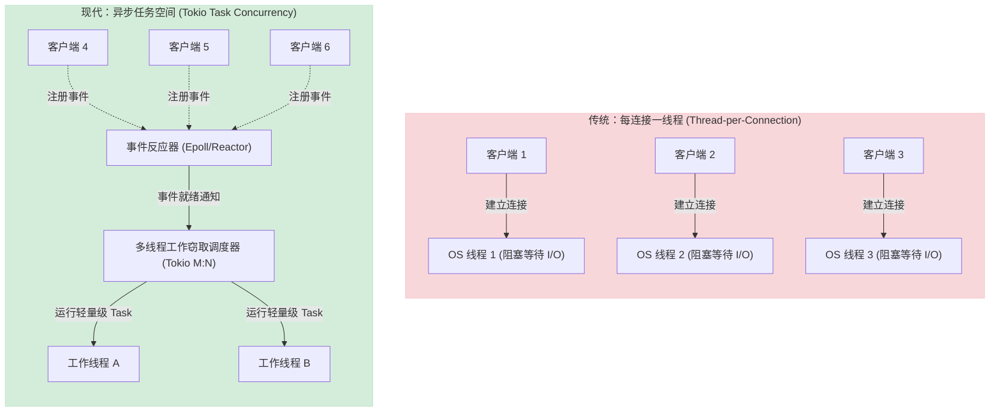
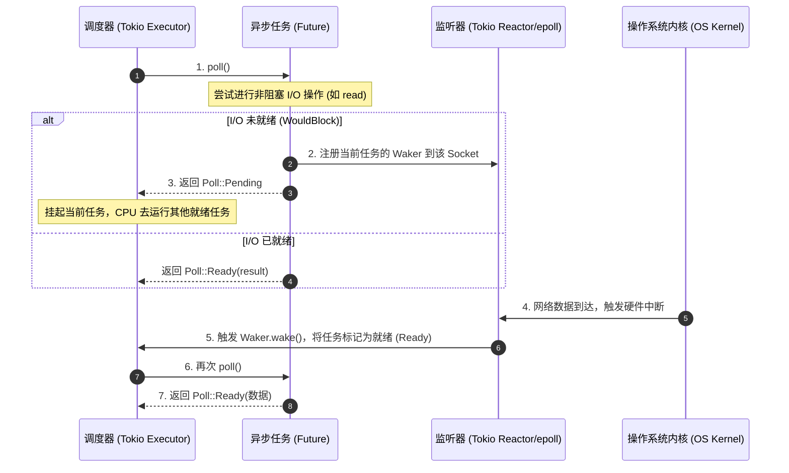

# 深入解析异步网络编程模型

高性能网络服务器的核心基石是**高并发、低延迟的 I/O 处理能力**。在 `trojan-rs` 项目中，这一能力完全基于 Rust 的异步生态体系（`async/await`、`Futures`）以及现代异步运行时 `Tokio` 来实现。

本文将探讨网络编程模型的演进，深度剖析 `trojan-rs` 中的异步网络编程实践，并介绍工业界在超高并发场景下的前沿技术经验。

---

## 一、 网络 I/O 模型的演进

在理解异步网络模型之前，我们需要对比传统的并发处理模型：

### 1. 传统模型：每连接一线程 (Thread-per-Connection)
最初的服务器设计中，每当一个新客户端连接进来，系统就会创建一个独立的操作系统线程来处理该连接。
* **致命缺陷**：
  1. **内存开销极高**：每个线程都有独立的栈空间（通常为 1MB~8MB），成千上万个连接会瞬间撑爆内存。
  2. **上下文切换开销（Context Switch）**：当线程因等待网络 I/O（如 `recv`）而阻塞时，CPU 必须频繁地在不同线程间切换，导致大部分 CPU 时间浪费在保存和恢复寄存器状态上。

### 2. 现代模型：事件驱动与反应器模式 (Reactor Pattern)
异步网络编程采用 **非阻塞 I/O (Non-blocking I/O)** 和 **多路复用技术（如 Linux 的 epoll、macOS 的 kqueue）**。
* **工作原理**：一个或少数几个工作线程（Event Loop）负责监听成千上万个套接字。当某个套接字可读或可写时，操作系统内核会通知工作线程，工作线程再派发任务进行处理。

#### 线程并发 vs 异步任务协程 并发对比图



---

## 二、 `trojan-rs` 中的异步网络编程实践

`trojan-rs` 基于 Rust 的 `Tokio` 异步运行时，实现了一个高性能的 `M:N` 协程调度模型（将数十万个轻量级任务 `Task` 映射到少量的物理线程上）。

### 1. 轻量级任务调度：`tokio::spawn`
在 [src/proxy/relay.rs](file:///d:/dev/trojan-rs/src/proxy/relay.rs#L154-L209) 的代理入口函数 `run_proxy` 中，每当 `acceptor` 接收到一个新连接，并不会创建系统线程，而是调用 `tokio::spawn`：

```rust
pub async fn run_proxy<I: ProxyAcceptor>(acceptor: I) -> io::Result<()> {
    loop {
        match acceptor.accept().await {
            Ok(AcceptResult::Tcp((inbound, addr))) => {
                // ... 准备工作
                tokio::spawn(async move {
                    // 在后台任务中异步处理 TCP 转发，不阻塞主循环
                    if let Ok(outbound) = TcpStream::connect(addr.to_string()).await {
                        relay_tcp(metered_inbound, outbound).await;
                    }
                });
            }
            // ...
        }
    }
}
```
* **工作窃取调度器 (Work-Stealing Scheduler)**：`Tokio` 的多线程运行时（`rt-multi-thread`）在后台维护了一个线程池。每个工作线程都有一个本地任务队列。如果某个工作线程闲下来，它会从其他忙碌线程的队列中“窃取”任务来运行，从而保证所有 CPU 核心的负载均衡。

### 2. Rust Future 的惰性与协作式调度
Rust 的异步是**基于拉取（Pull）**而不是推送（Push）的，即 `Future` 默认是惰性的（Lazy），只有在被 `poll` 时才会执行。

#### Rust 异步 Future 的 Poll 生命周期



### 3. 多路异步选择：`tokio::select!`
在网络编程中，经常需要同时等待多个异步事件（例如：同时等待“上行数据”和“下行数据”，或者等待“数据到达”和“超时定时器”）。`trojan-rs` 频繁使用了 `tokio::select!` 宏。

在 `relay.rs` 的 UDP 转发 [relay_udp_with_meters](file:///d:/dev/trojan-rs/src/proxy/relay.rs#L50-L70) 中，上行拷贝和下行拷贝是并发进行的，任何一侧出错或结束都会导致整个 session 关闭：
```rust
tokio::select! {
    e = t1 => {e}
    e = t2 => {e}
}
```
在 [src/protocol/singbox_mux.rs](file:///d:/dev/trojan-rs/src/protocol/singbox_mux.rs#L116-L123) 中，读取首包时结合了超时：
```rust
match timeout(h2_preface_byte_timeout, stream.read(&mut byte)).await {
    Ok(read) => read?,
    Err(_) => { /* 超时处理 */ }
}
```

---

## 三、 Rust 异步的核心概念：`Pin` 与 `Unpin`

在阅读 `trojan-rs` 源码时，你会注意到很多 trait 定义（如 `ProxyTcpStream`）带有 `Unpin` 约束：
```rust
pub trait ProxyTcpStream: AsyncRead + AsyncWrite + Send + Sync + Unpin {}
```

### 1. 为什么需要 `Pin`？
当编写 `async` 块时，编译器会将其转化为一个**状态机（State Machine）**。如果异步函数内部有局部变量跨越了 `await` 边界，这个状态机就可能包含**自引用指针（Self-referential Pointers）**（即结构体内部的某个成员指向了自身的另一个成员）。

如果这个状态机在内存中被移动（例如被 `swap` 或传参），自引用指针就会指向一个无效的内存地址，导致内存安全问题。`Pin` 的作用就是**在类型系统层面上锁定一个值在内存中的位置，防止其被移动**。

### 2. 什么是 `Unpin`？
大部分不需要自引用的类型（如普通的 `TcpStream`、`i32`、`String`）都是 `Unpin` 的，这意味着它们即使被移动也是安全的。在 `trojan-rs` 中，声明 `Unpin` 约束可以让这些套接字类型更容易在不同的异步 Task 之间传递和操作，而不需要显式地进行内存固定。

---

## 四、 其他高并发场景下的行业实践经验

虽然 `Tokio` 的多线程工作窃取模型非常通用，但在极致的超高性能网络网关（如百万级并发、微秒级延迟）中，存在着不同的架构选择：

### 1. 无共享与单线程绑定架构 (Share-Nothing / Thread-per-Core)
* **传统 Tokio 痛点**：多线程工作窃取模型需要频繁在物理线程间传递 Task，这涉及到跨 CPU 核心的数据拷贝和原子锁操作，会导致 CPU 的 L1/L2 缓存失效（Cache Miss）。
* **实践经验**：
  * **Seastar (C++)** 和 **Glommio (Rust)** 框架采用 **Thread-per-Core (单核单线程)** 架构。
  * 每个 CPU 核心上只运行一个独立的事件循环，每个核心拥有自己专属的网卡队列和内存空间，核心之间**不共享任何数据**。
  * 这种“无锁化”设计消除了线程间同步开销，能将网关的吞吐量榨干到硬件极限。

### 2. 下一代 Linux 异步接口：`io_uring`
传统的 `epoll` 仍然需要频繁进行系统调用（如每次读写都要调用 `read`/`write`，每次修改监听都要调用 `epoll_ctl`），这在极高并发下会产生巨大的上下文切换开销。
* **实践经验**：
  * **`io_uring`** 是 Linux 内核近年引入的全新异步 I/O 接口。它在内核和用户空间之间共享两个**环形缓冲区（Ring Bufferes）**：提交队列（SQ）和完成队列（CQ）。
  * 应用程序只需将 I/O 请求放入提交队列，无需发起任何系统调用，内核会自动处理；处理完成后，应用程序直接从完成队列读取结果。
  * 在 Rust 生态中，基于 `io_uring` 开发的运行时（如 `monoio`、`tokio-uring`）在吞吐量和延迟上明显优于传统的 `epoll` 运行时。

---
*本文档收录于项目的知识库建设，旨在帮助开发者掌握基于 Rust 生态的现代化异步网络编程精髓。*
