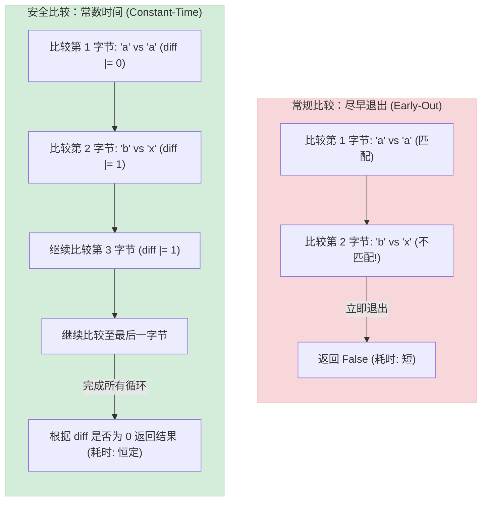
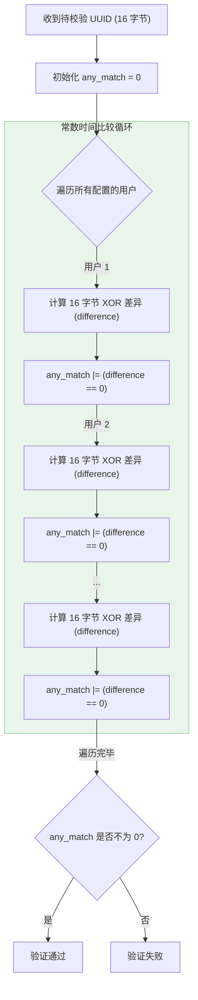

# 深入解析代理协议中的鉴权机制与防时序攻击 (Timing Attack) 实践

在网络安全和代理协议的设计中，**身份鉴权（Authentication）**是第一道防线。然而，仅仅实现“密码匹配”是不够的。在密码学中，代码的执行时间本身也是一种泄露通道。如果处理不当，审查者可以通过微秒级的时间差，通过**时序攻击（Timing Attack）**探测并攻破服务器。

本文将深入分析时序攻击的原理，详解 `trojan-rs` 中如何利用 **常数时间比较（Constant-Time Comparison）** 安全地验证 Trojan 的 SHA-224 哈希与 VLESS 的 16 字节 UUID，并分享行业在防重放攻击等领域的安全实践。

---

## 一、 时序攻击 (Timing Attack) 的原理

时序攻击是一种**侧信道攻击（Side-Channel Attack）**。它不通过破解加密算法本身，而是通过测量**代码执行的时间差异**来获取敏感信息。

### 1. 传统字符串比较的缺陷
在大多数编程语言中，标准的字符串或数组比较（如 Rust 的 `==` 运算符）为了性能，采用的是**尽早退出（Early-Out）**策略：
* 比较 `abcde` 和 `axxxx`：在第 2 个字符发现不匹配，立即返回 `false`。
* 比较 `abcde` 和 `abxxx`：在第 3 个字符发现不匹配，返回 `false`。
* 每一个字符匹配成功，CPU 都会多进行一次循环和比较，这会带来**极其微小但可测量的延迟**。

### 2. 防火墙的利用方式
如果代理服务端的鉴权代码存在这种时间差，防火墙可以通过向服务器发送大量精心构造的非法密码，并用高精度时间戳记录服务器断开连接（或返回 Fallback 响应）的时间。通过统计分析，防火墙可以在不需要知道正确密码的情况下，**逐个字节地猜出正确密码**。

#### 尽早退出比较 vs 常数时间比较



---

## 二、 `trojan-rs` 中的 Trojan 鉴权防线

Trojan 协议的请求头格式如下：
$$\text{Trojan 请求头} = \text{hex(SHA224(password))} + \text{CRLF} + \text{指令 (1 byte)} + \text{目标地址} + \text{CRLF}$$

在 [src/protocol/trojan/mod.rs](file:///d:/dev/trojan-rs/src/protocol/trojan/mod.rs) 中，`trojan-rs` 实施了多重安全防御。

### 1. 防 TCP 分片干扰
网络传输中，TCP 报文可能会被分片。如果服务端一次 `read` 没有读满 56 字节就直接判定失败，不仅会造成误判，还会产生时间特征。
在 [read_from](file:///d:/dev/trojan-rs/src/protocol/trojan/mod.rs#L65-L87) 中，系统通过循环读取，确保完整获取 56 字节的哈希值：

```rust
while offset < HASH_STR_LEN {
    match stream.read(&mut hash_buf[offset..]).await? {
        0 => break, // EOF
        n => offset += n,
    }
}
```

### 2. 完美的常数时间哈希校验
在读取到 56 字节后，`trojan-rs` 没有使用任何快捷比较，而是通过**按位异或（XOR）**进行常数时间校验：

```rust
// Constant-time equality check to prevent timing attacks
let mut diff = 0;
for (a, b) in valid_hash.iter().zip(hash_buf.iter()) {
    diff |= a ^ b;
}

if diff != 0 {
    // 验证失败，记录首包并抛出错误（后续交由 Fallback）
    first_packet.extend_from_slice(&hash_buf);
    return Err(new_error("invalid password hash"));
}
```
* **原理解析**：`a ^ b` 在 `a` 和 `b` 相等时为 `0`，不等时为非 `0`。通过 `diff |= a ^ b`，只要有任何一个字节不等，`diff` 最终就会变为非 `0`。
* **安全成效**：无论密码是在第 1 个字节不匹配，还是在最后一个字节不匹配，该循环都会完整执行 56 次，没有任何分支跳转，**执行时间完全恒定**，彻底消除了时序侧信道。

---

## 三、 `trojan-rs` 中的 VLESS 多用户常数时间检索

VLESS 协议使用 16 字节的 **UUID** 区分用户。当服务器配置了多个用户时，如果采用普通的查表方式，匹配到第一个用户和匹配到最后一个用户的耗时是不同的，这同样会泄露用户列表的顺序和数量。

在 [src/protocol/vless/mod.rs](file:///d:/dev/trojan-rs/src/protocol/vless/mod.rs) 中，`trojan-rs` 实现了一个非常精妙的常数时间多用户检索函数 [contains_user](file:///d:/dev/trojan-rs/src/protocol/vless/mod.rs#L124-L134)：

```rust
fn contains_user(valid_users: &[[u8; 16]], candidate: &[u8]) -> bool {
    let mut any_match = 0u8;
    for user in valid_users {
        let mut difference = 0u8;
        for (expected, actual) in user.iter().zip(candidate.iter()) {
            difference |= expected ^ actual;
        }
        // 如果 difference 为 0，说明匹配成功，(difference == 0) as u8 值为 1
        any_match |= (difference == 0) as u8;
    }
    any_match != 0
}
```

#### VLESS 多用户检索流程图



### 为什么该设计极其安全？
1. **防爆破定位**：即使探测者不断尝试爆破，由于无论匹配到哪个用户，耗时都完全相同，探测者无法得知自己是否“接近”了某个特定的合法 UUID。
2. **执行时间只与用户数量正相关**：对于相同的配置，不论输入的 UUID 是否合法，`contains_user` 都会完整遍历所有用户的所有字节。其时间开销仅取决于配置的用户总数 $N$，消除了由于“匹配成功提早退出”带来的信息泄露。

---

## 四、 行业密码学安全最佳实践

在更复杂的代理协议中，除了防时序攻击外，还需要防范以下两类密码学攻击：

### 1. 防重放攻击 (Anti-Replay Attack)
* **威胁情景**：审查者截获了客户端发送给代理服务器的合法握手数据包（即使他们无法解密）。随后，审查者原封不动地将该数据包重新发送给服务器。如果服务器响应了，或者向目标网站发起了连接，审查者就能确认这是一个代理服务器。
* **实践经验**：
  * **滑动窗口与过滤器**：Shadowsocks (AEAD) 协议在服务端维护一个**防重放过滤器**（通常基于 Bloom Filter 或带有时戳的滑动窗口）。
  * 服务端会解密报文中的时间戳（要求与服务器时间差在 100 秒内），并记录每个数据包的唯一标识（如 AEAD 的 Salt 或 Nonce）。如果收到已经记录过的 Nonce，或者时间戳过期，则直接判定为重放攻击，静默断开连接。

### 2. 认证加密 (AEAD - Authenticated Encryption with Associated Data)
早期的代理协议（如 Shadowsocks 早期版本）只加密了数据，但没有对密文进行**完整性校验**。这使得攻击者可以通过篡改密文的某些字节，观察服务器解密失败后的特定反应（如主动断开或报错），从而逐步解密出流量内容（即**主动干扰检测攻击**）。
* **实践经验**：
  * 现代代理全面采用 **AEAD 加密算法**（如 `AES-256-GCM`、`ChaCha20-Poly1305`）。
  * 每一段密文都附带一个认证标签（TAG/MAC）。服务端在解密前会先利用密钥验证标签的完整性。一旦发现任何篡改，直接拒绝处理，从根本上杜绝了密文篡改探测。

---
*本文档收录于项目的知识库建设，旨在帮助开发者掌握高安全等级的网络协议鉴权设计与侧信道防护。*
