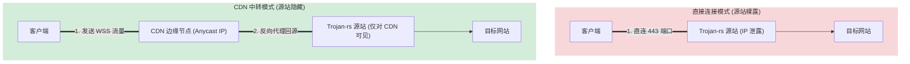

# CDN 穿透与隐藏代理源站原理

在对抗网络审查和分布式拒绝服务（DDoS）攻击时，**隐藏真实服务器 IP（源站 IP）**是最行之有效的防御手段。借助于支持 WebSocket 的**内容分发网络（CDN）**，我们可以将代理服务器隐藏在 CDN 的庞大节点网络背后。

本文将详细探讨 CDN 中转代理流量的底层原理、网络拓扑架构、以及保障源站安全的极端重要配置。

---

## 一、 CDN 中转的基本原理

### 1. 为什么普通 TLS 流量无法通过 CDN？
传统的 CDN（如 Cloudflare, CloudFront）是设计用来加速网页访问的。它们只认识 **HTTP、HTTPS 和 WebSocket** 协议。
* 如果你尝试将裸 TCP/TLS 流量（如裸 Trojan 或 VLESS over TCP）发给 CDN 节点，CDN 会因为无法识别应用层协议而直接断开连接。
* 因此，要利用 CDN，代理流量必须被封装在 **WebSocket (WSS)** 之中。

### 2. CDN 如何隐藏源站 IP？
当配置了 CDN 中转后，客户端不再直接连接代理服务器，而是连接到 CDN 的边缘节点：
1. 客户端发起对 CDN 域名的 DNS 解析，获得的是 **CDN 节点的公网 IP**。
2. 客户端向 CDN 节点发起 HTTPS 连接，并发送 WebSocket 握手请求。
3. CDN 节点作为**反向代理**接收请求，并在内部将该连接转发给你的**真实源站服务器**。
4. 所有的代理数据都在这条双向隧道中传递。防火墙（DPI）只能看到客户端在与 CDN 的节点进行高密度的加密通信，而无法探知源站的真实 IP。

---

## 二、 网络拓扑与流量路径

### 1. 正常代理与 CDN 中转拓扑对比



---

## 三、 保障源站安全的致命配置

仅仅开启 CDN 代理是不够的。如果配置不当，审查者或黑客可以通过其他途径绕过 CDN，直接扫描并定位你的真实源站 IP。以下两项配置至关重要：

### 1. 源站防火墙白名单（必须配置）
如果你的源站服务器（运行 `trojan-rs` 的服务器）的 443 端口对全网公开，那么扫描者可以直接绕过 CDN，通过扫描 IP 段发现你的服务。
* **防护措施**：源站服务器的防火墙（如 `iptables` 或 `ufw`）必须配置为**仅允许 CDN 节点的 IP 段访问 443 端口**。
* **例如（Cloudflare）**：Cloudflare 公开公布了其所有的 [IPv4 和 IPv6 节点范围](https://www.cloudflare.com/ips/)。你需要在服务器上配置规则，丢弃除这些 IP 之外的所有入站流量。

#### 绕过 CDN 攻击与防火墙防御拦截

```mermaid
flowchart TD
    subgraph AttackerScope ["黑客/审查者扫描"]
        A["探测者/扫描器"]
    end

    subgraph ServerScope ["源站服务器 (Trojan-rs)"]
        FW{"防火墙 (iptables)"}
        App["Trojan-rs 服务 (443)"]
        FW -->|仅允许 CF IP 回源| App
    end

    CF["Cloudflare 边缘节点"]

    CF ===|1. 合法回源请求| FW
    FW -->|放行| App

    A -.->|2. 绕过 CF 直接扫描源站 IP| FW
    FW -.->|3. 拦截并丢弃 (Drop)| Block["扫描失败 (无任何响应)"]

    style FW fill:#ffcc80,stroke:#f57c00
    style Block fill:#ffecb3,stroke:#ffe082
```

### 2. 防止 DNS 历史记录泄露
如果在将域名接入 CDN 之前，该域名曾经直接解析到你的源站 IP，那么审查者可以通过查询 **DNS 历史解析记录（DNS History）** 轻易获取你的真实 IP。
* **最佳实践**：在购买新域名后，**必须先在 DNS 解析服务商处开启 CDN 代理（如 Cloudflare 的云朵图标变黄），然后再添加解析记录**。切勿让域名在“直连”状态下暴露于公网。

### 3. SNI 与证书一致性
当 CDN 节点向源站服务器发起“回源”连接时，会进行 TLS 握手。
* 源站服务器 `trojan-rs` 的证书所对应的域名，必须与 CDN 回源配置中设置的 **SNI (Host Header)** 完全一致。
* 如果不一致，TLS 握手会失败，CDN 会向客户端返回 `526 Invalid SSL Certificate` 错误。

---

## 四、 CDN 中转的优缺点权衡

在实际部署中，是否采用 CDN 中转需要根据网络环境进行权衡：

| 维度 | 直连模式 (Direct) | CDN 中转模式 (WSS + CDN) |
| :--- | :--- | :--- |
| **安全性/防封锁** | 较低（源站 IP 容易被封） | 极高（源站 IP 无法被直接探测） |
| **网络延迟 (Latency)**| 最低（RTT 仅为客户端到源站） | 较高（RTT 增加了客户端到 CDN 以及 CDN 到源站的两段延迟） |
| **速度与吞吐量** | 取决于单端链路质量，通常上限较高 | 受限于 CDN 节点的带宽限制及回源线路优化（免费 CDN 在高峰期可能限速） |
| **抗 DDoS 能力** | 极弱（直接打死源站） | 极强（由 CDN 庞大的分布式网络抗下所有流量） |

---
*本文档收录于项目的知识库建设，旨在帮助开发者掌握基于 CDN 反向代理的架构设计与网络安全防御。*
