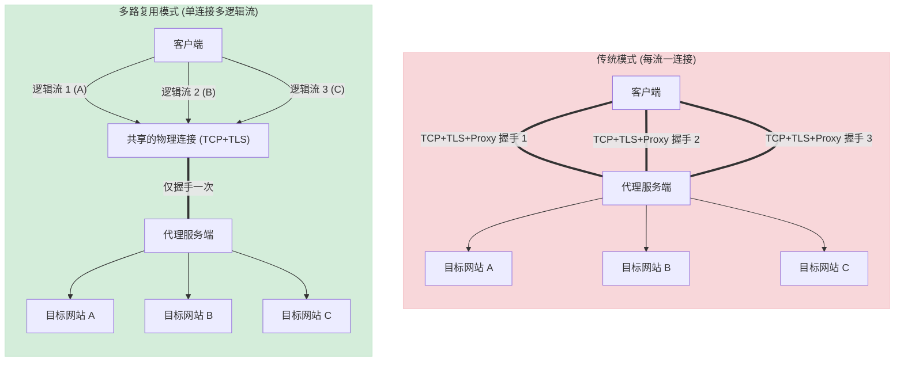
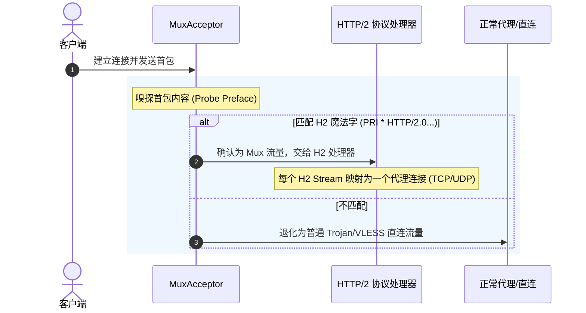
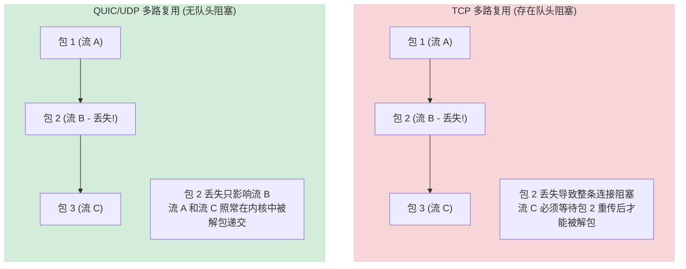

# 深入解析多路复用 (Multiplexing) 机制

在网络代理与隧道技术中，**多路复用（Multiplexing，简称 Mux）**是提升传输效率、降低连接延迟并增强混淆隐蔽性的关键技术。

本文将详细探讨多路复用的底层逻辑，深度剖析 `trojan-rs` 中实现的三种不同 Mux 协议（Trojan-Go Smux、VLESS Mux.Cool、sing-box h2mux），并结合行业实践分析其优缺点与最佳实践。

---

## 一、 为什么需要多路复用？

### 1. 传统代理模式的痛点：频繁握手与连接特征
在不启用多路复用时，客户端每发起一个网络请求（例如网页中的一张图片、一个 API 请求），代理客户端都需要与代理服务端建立一个新的物理连接：
$$\text{新连接} = \text{TCP 握手} + \text{TLS 握手} + \text{代理协议握手（如 Trojan/VLESS）}$$
这带来了两大致命缺陷：
1. **高延迟（Latency）**：在 RTT（往返时延）较大的跨境网络中，多次握手会导致首包延迟（TTFB）极高。
2. **易受特征分析**：频繁建立的、短生命周期的 TLS 连接，其握手指纹（ClientHello）和流量时序特征非常容易被防火墙（如 GFW）通过机器学习算法识别。

### 2. 多路复用原理：单通道，多信道
多路复用技术通过在**单一的底层 TLS 连接（物理通道）**上，并发传输**多个逻辑连接（子信道/Stream）**来解决上述问题。

#### 传统模式 vs 多路复用模式



---

## 二、 `trojan-rs` 中的三种多路复用实现

`trojan-rs` 支持三种主流的代理多路复用协议，它们的设计侧重点各有不同。

### 1. Trojan-Go 风格 Mux (基于 Smux v1)
基于 HashiCorp 的 `Smux` (Simple Multiplexing) 协议规范实现，代码位于 [src/protocol/mux/mod.rs](file:///d:/dev/trojan-rs/src/protocol/mux/mod.rs)。

* **帧结构 (Frame)**：
  每个 Smux 帧有一个 8 字节的固定头部：
  ```
  +---------+---------+-------------------+-------------------------------+
  | Version |   Cmd   |  Length (16-bit)  |       StreamID (32-bit)       |
  +---------+---------+-------------------+-------------------------------+
  |  1 byte |  1 byte |      2 bytes      |            4 bytes            |
  +---------+---------+-------------------+-------------------------------+
  |                 Payload (Length 字节的实际数据...)                     |
  +-----------------------------------------------------------------------+
  ```
* **控制指令 (`Cmd`)**：
  * `CMD_SYNC` (0)：新建逻辑流。在此帧的 Payload 中会包含目标地址信息（如 `CMD_TCP_CONNECT` 或 `CMD_UDP_ASSOCIATE`）。
  * `CMD_PUSH` (2)：推送数据。
  * `CMD_FINISH` (1)：关闭逻辑流（半关闭/全关闭）。
  * `CMD_NOP` (3)：空操作，用于心跳保活。
* **特点**：极其轻量，头部开销极小（仅 8 字节），适合嵌入式或低性能设备。

---

### 2. VLESS Mux.Cool 协议
这是 V2Ray 生态的标准多路复用实现，代码位于 [src/protocol/vless/mux_cool.rs](file:///d:/dev/trojan-rs/src/protocol/vless/mux_cool.rs)。

* **帧结构**：
  Mux.Cool 采用动态长度的元数据头部：
  ```
  +-----------------------+---------------------+---------------+----------------+----------------------+
  | Metadata Len (16-bit) |  SessionID (16-bit) | Status (8-bit)| Option (8-bit) | [Target Addr (Opt)]  |
  +-----------------------+---------------------+---------------+----------------+----------------------+
  |        2 bytes        |       2 bytes       |     1 byte    |     1 byte     |       可变长度        |
  +-----------------------+---------------------+---------------+----------------+----------------------+
  | [Data Length (16-bit, Opt)] |               [Payload (Opt)]                                         |
  +-----------------------------+-----------------------------------------------------------------------+
  ```
* **状态设计 (`Status`)**：
  * `STATUS_NEW` (0x01)：代表新连接，此时头部必须携带目标地址。
  * `STATUS_KEEP` (0x02)：保持连接，传输后续数据。
  * `STATUS_END` (0x03)：结束连接。
  * `STATUS_KEEP_ALIVE` (0x04)：心跳包。
* **特点**：相比 Smux，Mux.Cool 针对代理场景做出了深度优化，对 UDP 报文的关联支持更为紧凑。

---

### 3. sing-box h2mux (基于标准 HTTP/2)
使用标准的 **HTTP/2** 协议作为多路复用载体，代码位于 [src/protocol/singbox_mux.rs](file:///d:/dev/trojan-rs/src/protocol/singbox_mux.rs)。

* **工作原理**：
  1. 客户端向特定的伪装域名发送请求：`sp.mux.sing-box.arpa:444`。
  2. 服务端在收到入站连接时，首先通过 [probe_h2_preface](file:///d:/dev/trojan-rs/src/protocol/singbox_mux.rs#L109-L137) 嗅探前几个字节是否为 HTTP/2 的前导符（`PRI * HTTP/2.0\r\n\r\nSM\r\n\r\n`）。
  3. 如果匹配，则交由 HTTP/2 协议处理器（基于 Rust `h2` 库）进行处理，每个 HTTP/2 Stream 承载一个逻辑连接。
  4. 如果不匹配，则回退为普通的直连（Direct）模式。

#### h2mux 协商与路由流程



* **特点**：
  * **流控机制 (Flow Control)**：HTTP/2 拥有完善的窗口更新机制（WINDOW_UPDATE），能防止单个逻辑流由于发送过快而撑爆服务端的内存，或者饿死其他逻辑流。
  * **完美的混淆**：由于流量完全符合标准的 RFC 7540 (HTTP/2) 规范，防火墙极难将其与正常的 HTTPS 网站（如使用了 gRPC 或 H2 的网站）区分开。

---

## 三、 行业实践经验与技术对比

在生产环境中部署多路复用时，需要权衡不同的网络环境和业务场景：

| 特性 | Trojan-Go Mux (Smux) | VLESS Mux.Cool | sing-box h2mux (HTTP/2) |
| :--- | :--- | :--- | :--- |
| **基础协议** | 自定义 (Smux v1) | 自定义 (Mux.Cool) | 标准 RFC 7540 (HTTP/2) |
| **头部开销** | 极小 (8 字节) | 较小 (动态 6+ 字节) | 中等 (H2 帧头 + 流量控制) |
| **流量控制** | 无 / 较弱 | 无 | 强 (基于 Window) |
| **抗封锁能力**| 中等 (特征相对明显) | 中等 | 极强 (完美伪装为 H2 流量) |
| **适用场景** | 资源受限的嵌入式设备 | V2Ray 生态兼容 | 高带宽、对抗深度包检测 (DPI) |

### 1. 致命缺陷：TCP 队头阻塞 (Head-of-Line Blocking)
这是所有基于 TCP 底层连接的多路复用技术共同的痛点。

* **问题描述**：在 TCP 连接中，所有数据包必须按顺序递交。如果在跨境链路上，底层的 TLS TCP 连接丢掉了一个数据包，**整条 TCP 连接都会被阻塞**，直到该数据包重传成功。这意味着，即使你的 Mux 连接里跑了 50 个逻辑流，其中 49 个没有丢包，它们也必须一起等待那 1 个丢包的流重传完毕。
* **实践经验**：在**高丢包率、高延迟**的网络环境下，开启多路复用反而会导致网页加载变慢、游戏卡顿。因此，多路复用更适合在**低丢包率、高带宽**的优质链路上使用。

### 2. 终极解决方案：基于 UDP (QUIC / HTTP/3) 的多路复用
为了彻底解决 TCP 队头阻塞，现代工业界（如 HTTP/3、gRPC over HTTP/3、以及新型代理协议 TUIC、Hysteria）转向了基于 **QUIC (UDP)** 的多路复用。



* **原理**：QUIC 在 UDP 之上实现了分流。每一个 Stream 都有独立的收发窗口和重传控制器。当某一个 Stream 发生丢包时，只有该 Stream 会被挂起，其他 Stream 依然可以并行传输。
* **趋势**：在新一代网络工具中，基于 QUIC 的多路复用正在逐步取代传统的 TCP Mux。

---
*本文档收录于项目的知识库建设，旨在帮助开发者掌握高性能代理的多路复用演进方向。*
