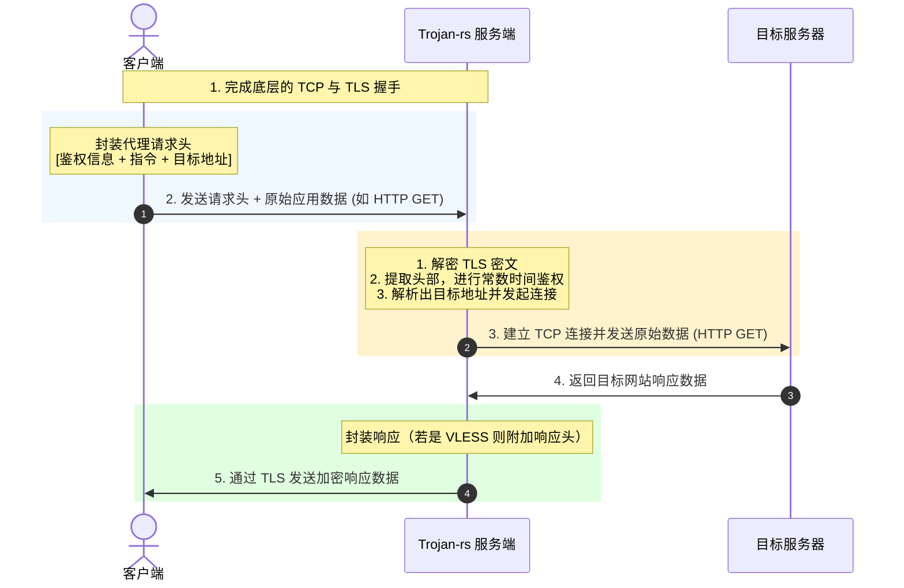

# Trojan 与 VLESS 协议结构深度解析

在网络代理的设计中，应用层协议定义了数据包如何封装、鉴权以及路由。`trojan-rs` 专注于实现两种主流的轻量级协议：**Trojan** 和 **VLESS**。它们都放弃了传统代理（如 Shadowsocks）复杂的自定义对称加密，转而依赖底层的 TLS 提供安全性，协议头部仅保留基础的鉴权和路由信息。

本文将深入拆解这两种协议在 TCP 和 UDP 模式下的数据帧报文结构。

---

## 一、 Trojan 协议结构

Trojan 协议的设计目标是**伪装**。它的报文格式被设计得极其类似于普通的 **SOCKS5** 协议，这使得其在被动和主动探测下都极具欺骗性。

### 1. Trojan TCP 请求头
当客户端通过 Trojan 协议发起 TCP 连接时，它会在 TLS 握手后的第一个数据包的最前端附加一个请求头：

```
+-----------------------+---------+--------+---------+----------+----------+---------+---------+
| hex(SHA224(password)) |  CRLF   |  CMD   |  ATYP   | DST.ADDR | DST.PORT |  CRLF   | Payload |
+-----------------------+---------+--------+---------+----------+----------+---------+---------+
|        56 bytes       | 2 bytes | 1 byte | 1 byte  | Variable | 2 bytes  | 2 bytes |   ...   |
+-----------------------+---------+--------+---------+----------+----------+---------+---------+
```

#### 各字段详解：
* **hex(SHA224(password))**：56 字节的密码哈希值（固定为十六进制字符串）。通过哈希运算，避免了在网络上明文传输密码。
* **CRLF**：回车换行符（`X'0D0A'`），作为鉴权字段的结束符。
* **CMD（指令）**：占 1 字节。
  * `X'01'`：`CONNECT`（建立 TCP 代理流）。
  * `X'03'`：`UDP ASSOCIATE`（建立 UDP 关联）。
* **ATYP（地址类型）**：占 1 字节，定义了目标地址的格式。
  * `X'01'`：IPv4 地址（固定 4 字节）。
  * `X'03'`：域名格式。第一个字节代表域名长度 $L$，后续跟随 $L$ 字节的域名。
  * `X'04'`：IPv6 地址（固定 16 字节）。
* **DST.ADDR（目标地址）**：长度可变，根据 `ATYP` 决定。
* **DST.PORT（目标端口）**：占 2 字节，采用大端序（网络字节序）。
* **CRLF**：第二次回车换行（`X'0D0A'`），代表 Trojan 请求头的结束。
* **Payload**：后续的原始应用层数据（如 HTTP 请求数据）。

---

### 2. Trojan UDP 报文格式
当进行 UDP 转发时，由于 UDP 是无连接的，每次发送数据都必须携带目标地址信息。Trojan 对每个 UDP 报文进行如下封装：

```
+---------+----------+----------+------------------+---------+---------+
|  ATYP   | DST.ADDR | DST.PORT | Length (16-bit)  |  CRLF   | Payload |
+---------+----------+----------+------------------+---------+---------+
| 1 byte  | Variable | 2 bytes  |     2 bytes      | 2 bytes |   ...   |
+---------+----------+----------+------------------+---------+---------+
```
* **Length**：占 2 字节，代表后续 `Payload` 的真实字节长度。
* **CRLF**：固定为 `X'0D0A'`。
* **Payload**：原始 UDP 数据报文。

---

## 二、 VLESS 协议结构

VLESS 是一个**无状态（Stateless）**的轻量级代理协议。与 Trojan 相比，它去除了第二次 `CRLF` 的设计，结构更加紧凑，且原生支持更加丰富的扩展机制（Addons）。

### 1. VLESS TCP 请求头
VLESS 的请求头紧凑且高效，格式如下：

```
+---------+---------------------+-------------+---------+---------+----------+----------+---------+
| Version |    UUID (16 bytes)  | Addons Len  | [Addons]|   CMD   |  Address | DST.PORT | Payload |
+---------+---------------------+-------------+---------+---------+----------+----------+---------+
|  1 byte |       16 bytes      |   1 byte    |  Var    | 1 byte  | Variable | 2 bytes  |   ...   |
+---------+---------------------+-------------+---------+---------+----------+----------+---------+
```

#### 各字段详解：
* **Version**：协议版本号，目前固定为 `X'00'`。
* **UUID**：16 字节（128 位）的原始二进制用户 ID，用于身份鉴权（相当于密钥）。
* **Addons Len**：附加信息长度（占 1 字节）。
* **Addons**：可变长度的附加信息。例如在 XTLS 流控（Flow）中，此处会携带流控握手信息。若 `Addons Len` 为 0，则该字段不存在。
* **CMD（指令）**：占 1 字节。
  * `X'01'`：`TCP`（建立 TCP 代理）。
  * `X'02'`：`UDP`（建立 UDP 代理）。
  * `X'03'`：`MUX`（多路复用控制流）。
* **Address**：目标地址，包含 1 字节的 `ATYP` 和可变长度的地址。
* **DST.PORT**：目标端口（2 字节，大端序）。

---

### 2. VLESS 响应头 (Response Header)
在 VLESS 协议中，服务端在向客户端回送目标网站的响应数据时，也会附加一个简短的响应头：

```
+---------+-------------+------------------+---------+
| Version | Addons Len  | [Addons Data...] | Payload |
+---------+-------------+------------------+---------+
|  1 byte |   1 byte    |     Variable     |   ...   |
+---------+-------------+------------------+---------+
```
* 如果连接建立成功，服务端会返回版本号及可选的 `Addons`，随后直接透传目标网站的数据。这使得协议的下行开销极低。

---

## 三、 Trojan 与 VLESS 结构对比与数据流可视化

### 1. 协议头结构对比

| 特性 | Trojan | VLESS |
| :--- | :--- | :--- |
| **鉴权凭证** | 56 字节 Hex 哈希 (SHA-224) | 16 字节原始二进制 UUID |
| **头部结束标志**| 两次 `CRLF` (`\r\n`) | 无特定标志，依靠字段长度自解析 |
| **扩展性 (Addons)**| 无原生扩展字段 | 原生支持可变长度 `Addons` |
| **下行开销** | 0 字节（直接透传原始数据） | 至少 2 字节（带有响应版本和附加信息）|

### 2. TCP 代理建连数据流可视化



---
*本文档收录于项目的知识库建设，旨在帮助开发者掌握主流代理协议的报文封装与设计规范。*
