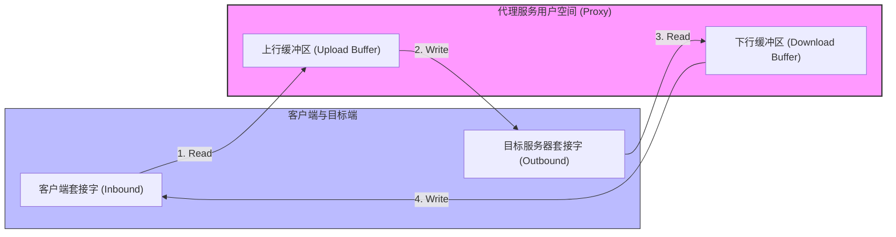
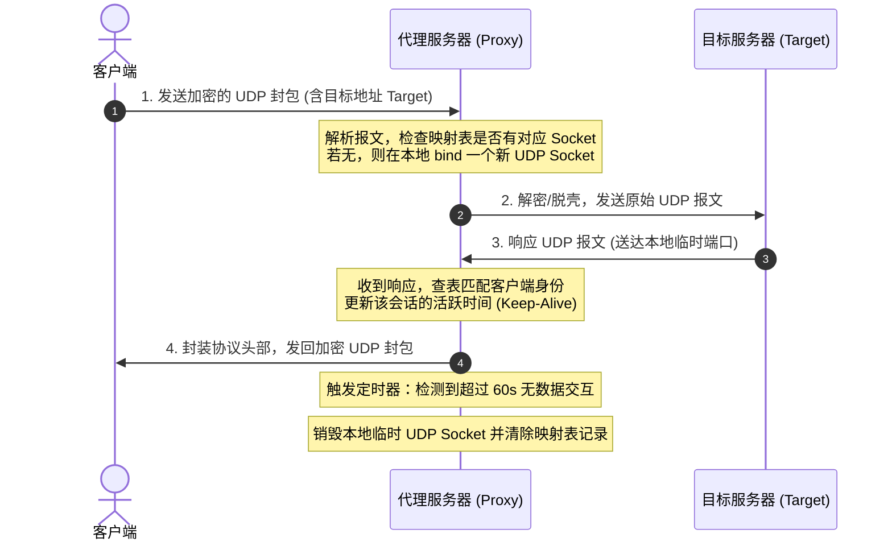
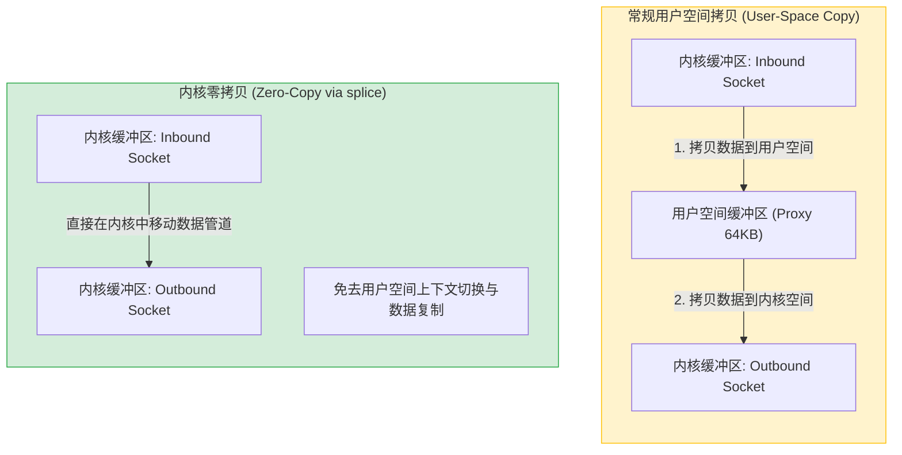

# 深入解析 TCP 与 UDP 转发机制

在代理与网络网关的设计中，**TCP 与 UDP 转发（Relaying/Forwarding）**是最核心的技术要点。由于 TCP 和 UDP 在协议层面的根本差异（面向连接的流 vs. 无连接的报文），代理服务端对它们的处理方式、资源管理和性能优化手段截然不同。

本文将深入剖析这两种转发机制的底层原理，详解 `trojan-rs` 项目中的具体实现，并结合行业实践分享其他高并发场景下的技术经验。

---

## 一、 转发机制的底层原理

### 1. TCP 转发：双向流拷贝 (Bidirectional Stream Copy)

TCP 是面向连接的、可靠的字节流协议。

* **基本原理**：当客户端与代理服务器建立 TCP 连接（入站连接 $Inbound$）并发送目标地址后，代理服务器会向真实目标服务器发起一个新的 TCP 连接（出站连接 $Outbound$）。一旦两个连接都建立成功，代理服务器的角色就退化为一个“管道”，不断将 $Inbound$ 读到的数据写入 $Outbound$，同时将 $Outbound$ 读到的数据写入 $Inbound$。
* **全双工特性**：TCP 支持全双工通信。转发机制必须能够同时进行双向传输。如果一侧的读取因等待数据而阻塞，不应影响另一侧的数据写入。

#### TCP 双向流拷贝模型



* **生命周期**：当任意一端发送 `FIN` 包（半关闭）或连接发生错误复位（`RST`）时，转发逻辑需要正确传播关闭信号，并在双向数据流都结束后释放套接字资源。

---

### 2. UDP 转发：无连接的报文关联 (Stateless Packet Association)

UDP 是无连接的、不可靠的报文协议。

* **基本原理**：UDP 没有“连接”的概念，只有孤立的报文（Datagram）。当客户端通过代理发送 UDP 报文时，代理服务器必须在本地绑定一个临时的 UDP 端口（或复用端口），并将报文发送给目标服务器。
* **NAT 关联 (UDP Association)**：由于 UDP 是无状态的，目标服务器回应的报文会发送到代理服务器绑定的那个临时端口。代理服务器必须维持一个**映射表（Session/Association Map）**，记录 `(客户端源地址, 目标地址) <-> 本地临时 socket` 的对应关系。当收到响应报文时，代理服务器查表并将报文封装后回传给对应的客户端。
* **超时机制**：因为没有连接关闭的信号（如 TCP 的 `FIN`），代理服务器必须依靠**超时定时器（Idle Timeout）**。如果某个 UDP 关联在一段时间内（例如 60 秒）没有任何数据交互，代理服务器必须主动销毁该 socket 并释放端口资源，否则会导致文件描述符（FD）泄漏。

#### UDP 关联与转发时序图



---

## 二、 `trojan-rs` 中的实现细节

在 `trojan-rs` 中，转发逻辑主要实现在 [src/proxy/relay.rs](file:///d:/dev/trojan-rs/src/proxy/relay.rs) 和 [src/protocol/mod.rs](file:///d:/dev/trojan-rs/src/protocol/mod.rs) 中。它基于 Rust 的异步运行时 `Tokio` 构建，充分利用了其高效的协程调度。

### 1. TCP 转发实现
在 `relay.rs` 的 [relay_tcp](file:///d:/dev/trojan-rs/src/proxy/relay.rs#L72-L79) 中：

```rust
pub async fn relay_tcp<T: ProxyTcpStream, U: ProxyTcpStream>(mut a: T, mut b: U) {
    if let Err(e) =
        copy_bidirectional_with_sizes(&mut a, &mut b, RELAY_BUFFER_SIZE, RELAY_BUFFER_SIZE).await
    {
        log::debug!("relay_tcp err: {}", e)
    }
    log::info!("tcp session ends");
}
```

* **高效的双向拷贝**：使用 `tokio::io::copy_bidirectional_with_sizes`。这是 Tokio 专门针对双向流转发优化的 API。它在内部维护了两个独立的缓冲区（大小为 `RELAY_BUFFER_SIZE = 64 KiB`），并在后台轮询两个流的读写就绪状态，避免了手动编写 `select!` 带来的额外开销和潜在的饥饿问题。
* **延迟优化**：在出站连接建立后，显式调用了 `outbound.set_nodelay(true)` 禁用 Nagle 算法。这确保了小包（如握手包、交互式数据）能够立即发送，显著降低了代理的传输延迟。

### 2. UDP 转发实现
由于 UDP 在代理协议中通常需要特殊的头部封装（如 Trojan 协议在 UDP 报文前会添加地址头），`trojan-rs` 抽象出了 `ProxyUdpStream`、`UdpRead` 和 `UdpWrite` 接口。

* **读写分离与并发**：
  [ProxyUdpStream](file:///d:/dev/trojan-rs/src/protocol/mod.rs#L40-L46) 提供了 `split` 方法，将流拆分为独立的读半部分（`UdpRead`）和写半部分（`UdpWrite`）。
  在 [relay_udp_with_meters](file:///d:/dev/trojan-rs/src/proxy/relay.rs#L50-L70) 中，双向转发任务通过 `tokio::select!` 并发执行：
  ```rust
  let (mut a_rx, mut a_tx) = a.split();
  let (mut b_rx, mut b_tx) = b.split();
  let t1 = copy_udp(&mut a_rx, &mut b_tx, upload_meter.as_mut());
  let t2 = copy_udp(&mut b_rx, &mut a_tx, download_meter.as_mut());
  tokio::select! {
      e = t1 => {e}
      e = t2 => {e}
  };
  ```
* **DNS 解析缓存**：
  出站端 [DirectUdpStream](file:///d:/dev/trojan-rs/src/proxy/relay.rs#L82-L117) 内部维护了一个 `resolved_addresses: Arc<Mutex<HashMap<Address, SocketAddr>>>`。由于 UDP 报文频繁发送，每次都进行异步域名解析（DNS Lookup）会带来极大的性能开销。项目通过在内存中缓存已解析的 IP 地址，避免了重复解析，提高了报文转发效率。

---

## 三、 其他场景下的行业实践经验

在更复杂的工业级场景（如高性能网关、 Shadowsocks、V2Ray、或游戏加速器）中，TCP/UDP 转发技术有着更深度的优化和不同的变种：

### 1. 零拷贝技术 (Zero-Copy)

在 `trojan-rs` 中，数据流经过了用户空间缓冲区（`[0u8; RELAY_BUFFER_SIZE]`）。在高吞吐量（如 10Gbps 网卡满载）的网关场景下，内核态与用户态之间的数据拷贝会成为 CPU 瓶颈。

#### 用户空间拷贝 vs 零拷贝 对比图



* **实践经验**：
  * **`splice` 系统调用**：在 Linux 系统中，可以使用 `splice(2)` 在两个文件描述符（如两个 socket 管道）之间直接移动数据，而无需将数据拷贝到用户空间。很多 C/C++ 编写的代理（如 `shadowsocks-libev`、`HAProxy`）在特定模式下会启用 `splice`。
  * **eBPF (Extended Berkeley Packet Filter)**：利用 eBPF 的 `sockmap` 技术，可以在内核的套接字层（Socket Layer）直接将一个 socket 的数据重定向到另一个 socket，完全绕过了内核 TCP/IP 协议栈的上层处理和用户态，延迟降到极致。

### 2. UDP 动态 NAT 穿透与锥形/对称 NAT 行为
在网络游戏加速器中，UDP 转发对 NAT 类型（NAT Type）非常敏感。
* **实践经验**：
  * **Full Cone NAT 保持**：游戏客户端通常需要“完全圆锥型（Full Cone）”的 NAT 映射。这就要求代理服务器在转发 UDP 时，对于同一个客户端内网 IP 和端口，无论它向哪个外网目标发送数据，代理服务器在出站时都必须复用**同一个本地 UDP 端口**。
  * **对称 NAT 的限制**：如果代理实现为每个不同的目标 IP 都绑定新的本地端口（类似于 `trojan-rs` 的新 socket 绑定），客户端在外界看来就是“对称型（Symmetric）”NAT，这会导致很多 P2P 游戏（如联机对战）无法直连。

### 3. UDP Over TCP (UOT) 与 拥塞控制
在恶劣的网络环境下，UDP 极易被运营商进行 QoS 限速或高比例丢包。
* **实践经验**：
  * **UDP 隧道化**：许多代理工具（如 V2Ray、tuic）支持将客户端的 UDP 报文打包，通过一个已经建立好的 TCP 连接（或者基于 UDP 的可靠传输协议如 QUIC/BBR）进行传输。
  * **优点**：可以利用 TCP 的重传机制保证 UDP 报文不丢包，并且可以利用 BBR 拥塞控制算法抢占带宽，防止因网络波动导致的游戏掉线或语音断流。
  * **缺点**：引入了 TCP 的队头阻塞（Head-of-Line Blocking）和额外的握手延迟。

### 4. 广播与组播支持 (Broadcast & Multicast)
局域网发现（如 mDNS、SSDP、Samba 共享）依赖于 UDP 广播或组播。
* **实践经验**：
  * 传统的点对点 UDP 转发（如 `trojan-rs` 里的 `DirectUdpStream`）只支持单播（Unicast）。
  * 在构建虚拟局域网（VLAN/VPN，如 Tinc, WireGuard, Tailscale）时，转发器需要支持将目标地址为 `255.255.255.255` 或组播地址（如 `224.0.0.x`）的 UDP 包进行广播复制，发送给所有虚拟网内的在线客户端。这通常需要配合虚拟网卡（TUN/TAP）在网络层（L3）或数据链路层（L2）进行报文解析和分发。

---
*本文档收录于项目的知识库建设，旨在帮助开发者深入了解网络代理底层的 I/O 运转逻辑。*
