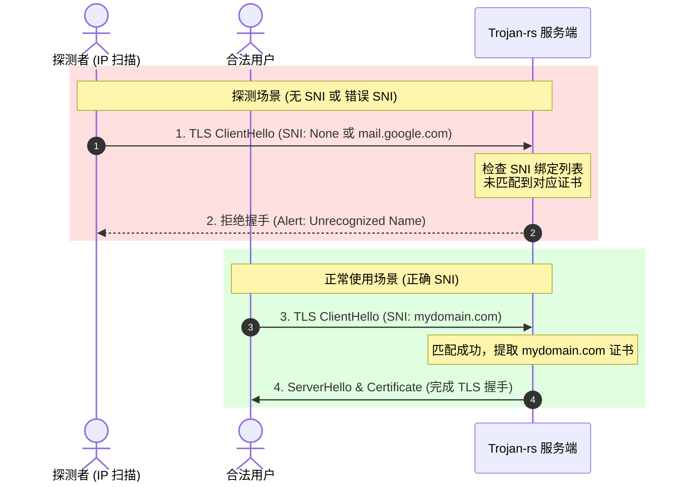
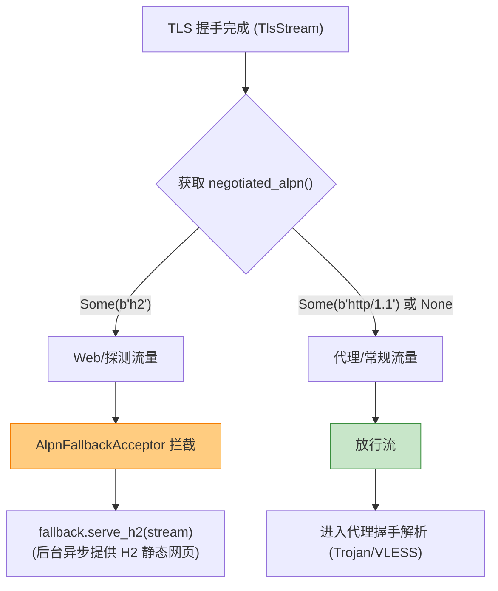

# 深入解析 TLS 握手、SNI 校验与 ALPN 分流机制

在现代网络安全与防审查技术中，**TLS (Transport Layer Security)** 是构建加密隧道的绝对基石。不论是 Trojan 还是 VLESS 协议，其核心思想都是**将代理流量完全融入标准的 TLS 加密流中**，使其在外观上与正常的 HTTPS 流量完全一致。

本文将深入分析 TLS 握手的底层细节，详解 `trojan-rs` 中基于 `rustls` 的证书加载、严格的 **SNI (Server Name Indication) 校验**、以及基于 **ALPN (Application-Layer Protocol Negotiation)** 的无感分流机制。

---

## 一、 TLS 在网络伪装中的核心作用

标准的 HTTPS 流量完全由 TLS 保护。防火墙（DPI）在不破解 TLS 的情况下，只能看到加密后的二进制垃圾数据，无法得知其传输的具体内容。

`trojan-rs` 放弃了自定义的加密算法，直接采用标准的 TLS 协议，从而获得了与主流网站相同的抗封锁能力。在 `trojan-rs` 中，TLS 的集成由 [src/protocol/tls/acceptor.rs](file:///d:/dev/trojan-rs/src/protocol/tls/acceptor.rs) 实现，使用了纯 Rust 编写的、安全高效的 `rustls` 库。

---

## 二、 严格的 SNI 校验：阻断主动 IP 扫描

### 1. 什么是 SNI？
在 TLS 握手的第一步，客户端会发送一个 `ClientHello` 报文。由于一个服务器 IP 可能托管了多个不同的域名，客户端必须在 `ClientHello` 的扩展字段中携带它想要访问的域名，这个字段就是 **SNI**。

### 2. 主动 IP 扫描与防探测
审查者经常会通过扫描公网 IP 的 443 端口来进行探测。如果他们直接通过 IP 地址建立 TLS 连接（此时 `ClientHello` 中**没有 SNI**，或者 **SNI 是随意的**）：
* **普通代理的行为**：无论客户端发什么 SNI，都直接完成 TLS 握手并出示证书。这暴露了“该 IP 只有一个代理服务”的特征。
* **`trojan-rs` 的安全防范**：在 [acceptor.rs](file:///d:/dev/trojan-rs/src/protocol/tls/acceptor.rs#L133-L136) 中，系统使用 `ResolvesServerCertUsingSni` 显式绑定了配置的域名：

```rust
let mut resolver = ResolvesServerCertUsingSni::new();
resolver
    .add(&config.sni, certified_key)
    .map_err(|e| new_error(format!("certificate does not match configured sni: {e}")))?;
```
* **效果**：如果探测者发起的 TLS 握手中没有携带匹配的 SNI，`rustls` 将**拒绝出示证书并中断 TLS 握手**。在探测者看来，这个 IP 的 443 端口就如同没有配置任何 HTTPS 服务一样，从而有效规避了 IP 扫描。

#### SNI 校验防御时序图



---

## 三、 ALPN 协商与无感回退分流 (AlpnFallbackAcceptor)

在 TLS 握手期间，客户端和服务端会通过 **ALPN** 扩展协商接下来要使用的应用层协议（如 `h2` 或 `http/1.1`）。`trojan-rs` 利用这一特性实现了一套优雅的分流机制：[AlpnFallbackAcceptor](file:///d:/dev/trojan-rs/src/protocol/tls/acceptor.rs#L50-L89)。

### 1. ALPN 宣告
在配置 TLS 阶段，服务端会根据是否启用 HTTP/2 Fallback 来宣告支持的协议：
```rust
server_config.alpn_protocols = if enable_http2_fallback {
    vec![b"h2".to_vec(), b"http/1.1".to_vec()]
} else {
    vec![b"http/1.1".to_vec()]
};
```

### 2. 拦截与分流逻辑
`AlpnFallbackAcceptor` 包装了底层的 TCP 接收器。在 `accept` 成功建立 TLS 连接后，它会立即检查协商出的 ALPN：

```rust
#[async_trait]
impl<T> ProxyAcceptor for AlpnFallbackAcceptor<T>
where
    T: ProxyAcceptor,
    T::TS: NegotiatedAlpn,
{
    type TS = T::TS;
    type US = T::US;

    async fn accept(&self) -> io::Result<AcceptResult<Self::TS, Self::US>> {
        loop {
            match self.inner.accept().await? {
                // 如果协商出的协议是 HTTP/2 (h2)，说明是普通的 Web 流量（或者是探测流量）
                AcceptResult::Tcp((mut stream, _addr))
                    if stream.negotiated_alpn() == Some(b"h2") =>
                {
                    if let Some(fallback) = &self.fallback {
                        // 拦截该流，直接在后台交由内置的 HTTP/2 静态服务处理
                        fallback.serve_h2(stream);
                    } else {
                        let _ = stream.shutdown().await;
                    }
                }
                // 如果是 http/1.1 或没有 ALPN，则放行给上层（进入 Trojan/VLESS 协议流）
                result => return Ok(result),
            }
        }
    }
}
```

#### ALPN 分流决策树



---

## 四、 TLS 握手超时防御

TLS 握手是一个涉及多次往返、需要进行复杂非对称加密计算的过程。这很容易被攻击者利用进行 **拒绝服务攻击 (DoS / Slowloris)**。
* 攻击者可以建立大量的 TCP 连接，但不发送 TLS 握手数据，或者以极慢的速度发送，从而占满服务器的线程或文件描述符。
* **`trojan-rs` 的防御**：在 [accept](file:///d:/dev/trojan-rs/src/protocol/tls/acceptor.rs#L102-L105) 中，对 TLS 握手步骤加了严格的超时限制（默认为 10 秒）：
```rust
let stream = timeout(self.handshake_timeout, self.tls_acceptor.accept(stream))
    .await
    .map_err(|_| new_error("TLS handshake timed out"))?
    .map_err(new_error)?;
```
一旦超时，连接会立即被释放，保护了服务器资源。

---

## 五、 其他场景下的行业实践经验

随着防火墙（DPI）检测技术的升级，仅靠标准的 TLS 已经无法做到 100% 安全，行业内演进出了更多高级对抗技术：

### 1. TLS 指纹识别 (JA3 / JA4 Fingerprinting)
DPI 防火墙可以通过分析 TLS `ClientHello` 中携带的**加密套件列表、扩展字段、支持的曲线、版本顺序**等特征，生成一个哈希值（即 **JA3/JA4 指纹**）。
* **问题**：很多代理客户端（如旧版 Clash 或 V2Ray）使用的 TLS 库（如 Go 的 `crypto/tls`）其指纹与普通的 Chrome/Safari 浏览器存在明显差异。
* **实践经验**：现代代理客户端广泛使用 **`uTLS`** 库，它能够动态模拟各种主流浏览器（Chrome, Firefox 等）的 ClientHello 指纹，使 TLS 握手在特征上与真实浏览器完全一致。

### 2. ECH (Encrypted Client Hello)
在标准的 TLS 1.3 中，虽然大部分握手过程已加密，但 `ClientHello` 中的 **SNI** 仍然是明文传输的。这使得中间人（如运营商）可以轻易得知你正在连接哪个域名。
* **前沿技术**：**ECH** 是 TLS 的最新草案扩展。它通过使用服务端的公钥，将整个 `ClientHello`（包括 SNI）加密打包在另一个外层“外壳”中。
* **现状**：目前由于需要特殊的 DNS 架构支持（HTTPS/SVCB 记录），在代理工具中的普及率仍在逐步上升中。

### 3. REALITY (无证书混淆)
传统的 TLS 代理（如 Trojan）需要用户自己申请 TLS 证书（如 Let's Encrypt），并配置私钥。这带来两个问题：
1. 证书申请记录是公开的（证书透明度日志 Certificate Transparency），容易被审查者爬取名单。
2. 证书的证书链和颁发机构可能暴露其代理属性。
* **REALITY 机制**：由 Xray 团队提出。
  * **原理**：REALITY 服务端**不需要证书**。它作为一个中转站，当客户端连接时，服务端直接“借用”一个真实、大牌的国外网站（如 `apple.com` 或 `microsoft.com`）的证书和握手流程。
  * **效果**：在外界看来，客户端就是在与 `apple.com` 进行完美的 TLS 1.3 握手，但握手完成后，数据流会被 REALITY 服务端接管并解密。这彻底免去了证书配置，并消除了证书特征。

---
*本文档收录于项目的知识库建设，旨在帮助开发者掌握高安全性的 TLS 加密与防御设计。*
