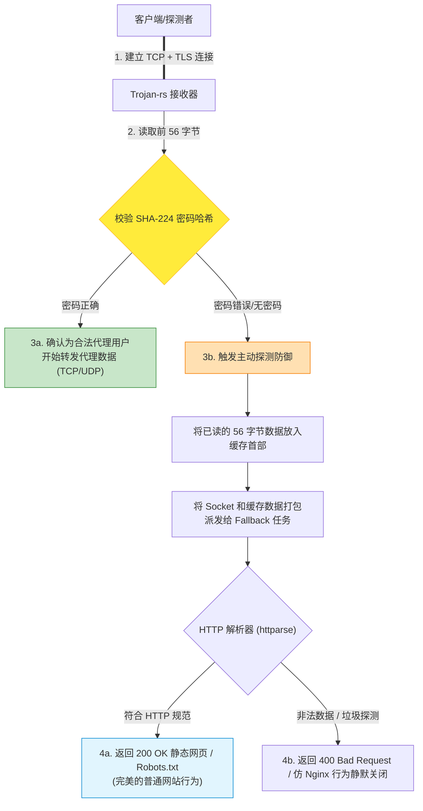

# 流量特征消除与防探测伪装技术

在网络对抗中，网络审查设备（如深度包检测 DPI）可以通过分析数据包的**统计学特征（如熵、包长度分布、时序）**和**主动探测（向服务器发送测试流量）**来识别代理服务。

`trojan-rs` 采用了一系列先进的**流量特征消除**与**伪装技术**，确保服务器在高度监控的环境下依然能够安全稳定运行。本文将深入解析这些技术背后的原理与实现。

---

## 一、 被动特征消除 (Passive Feature Elimination)

被动特征消除是指在网络流量传输过程中，不对外泄露任何可被统计学分析或指纹匹配的特征。

### 1. 消除熵（Entropy）异常
* **传统代理的问题**：诸如 Shadowsocks 等协议使用自定义的加密算法（如 AES-CFB/GCM）。由于所有传输数据都被高度随机化，其数据流的**信息熵（Entropy）**接近于物理极限 8（即完全随机）。然而，正常的 HTTPS 流量在握手阶段是包含明文握手信息的（熵较低）。防火墙可以通过检测“握手阶段即具有超高信息熵”的连接来精准识别并封锁传统代理。
* **`trojan-rs` 的解决办法**：完全抛弃自定义加密，将数据包裹在标准的 **TLS (Transport Layer Security)** 中。TLS 握手阶段包含标准的明文证书交互和握手特征，其信息熵曲线与普通的 HTTPS 网站完全一致，彻底消除了熵异常特征。

### 2. 对齐 TLS 客户端指纹 (TLS Fingerprint Alignment)
虽然服务端使用了标准的 TLS，但如果客户端（如 Clash、V2Ray 等）使用的 TLS 实现（如 Go 的 `crypto/tls`）其握手特征（支持的加密套件、扩展字段顺序、大数曲线等）与标准的浏览器（如 Chrome、Edge）不同，防火墙依然可以通过 **JA3/JA4 指纹** 将其识别。
* **防护建议**：客户端应当使用支持 **uTLS** 的内核，模拟真实浏览器的 ClientHello 指纹，确保从 TLS 协商阶段就完成完美伪装。

---

## 二、 主动探测防御 (Active Probing Prevention)

主动探测是指防火墙在发现一个疑似代理的 IP 后，主动模拟客户端向该 IP 发送测试数据包，并根据服务器的反应来判断其是否为代理。

`trojan-rs` 采用了极其精妙的 **无缝回退 (HTTP Fallback)** 机制来防御主动探测。

### 1. 传统代理在主动探测下的溃败
如果一个 IP 运行着传统代理，当防火墙向其发送一个标准的 `GET / HTTP/1.1` 请求时：
* 代理服务器由于无法解密该报文，通常会**立即断开连接**，或者**返回协议错误**。
* 防火墙根据这一反应，即可 100% 判定该端口不是 Web 服务，而是代理服务，进而实施封锁。

### 2. `trojan-rs` 的无感重定向机制
在 `trojan-rs` 中，如果鉴权失败，服务器**绝不会主动断开连接**，也不会发送任何代理协议的错误信息。

#### 鉴权失败时的“数据流接力”
在 [src/protocol/trojan/mod.rs](file:///d:/dev/trojan-rs/src/protocol/trojan/mod.rs#L89-L101) 中，当收到客户端发送的前 56 字节时，服务端会进行校验。如果校验失败（即密码错误，说明这大概率是一个探测请求或正常的网页访问）：
1. 服务端会将已经读取的这 56 字节数据，原封不动地塞回一个缓存区（`first_packet`）。
2. 将该套接字和已读数据一起，通过异步任务“接力”转交给内置的 **HTTP Fallback 静态网页服务器**。
3. Fallback 服务器将这些数据与后续收到的数据拼接，作为标准的 HTTP 请求进行解析，并返回配置好的静态 HTML 网页（如一个企业官网或个人博客）。

#### 鉴权失败与主动探测防御流程



---

## 三、 极端探测防御：仿 Nginx 异常行为

高级的防火墙不仅会探测“是否返回网页”，还会探测“遭遇异常请求时的反应”。标准的 Web 服务器（如 Nginx）在遇到非 HTTP 流量或格式错误的请求时，有一套高度特化的响应行为。
`trojan-rs` 在 [src/protocol/fallback.rs](file:///d:/dev/trojan-rs/src/protocol/fallback.rs) 中精确地模拟了这些行为：

### 1. 非 HTTP 流量的静默关闭
如果输入的头部前 4 个字节看起来完全不像任何合法的 HTTP 方法（如 `GET`, `POST`, `HEAD` 等），Nginx 的默认行为是直接关闭连接，不返回任何 HTTP 响应。
* `trojan-rs` 在 [serve](file:///d:/dev/trojan-rs/src/protocol/fallback.rs#L97-L100) 中进行了相同判定：
  ```rust
  if !looks_like_http(&prefix) {
      return stream.shutdown().await;
  }
  ```

### 2. 严格的方法过滤 (405 Method Not Allowed)
如果探测者使用了除 `GET` 和 `HEAD` 以外的方法（如 `POST`, `OPTIONS`），系统会返回标准的 `405` 响应，并携带必要的 `Allow: GET, HEAD` 头部，完全符合 RFC 规范：
```rust
FallbackRoute::MethodNotAllowed => ResponseSpec {
    status: "405 Method Not Allowed",
    content_type: "text/html; charset=utf-8",
    extra_headers: "Allow: GET, HEAD\r\nCache-Control: no-cache\r\n",
    head_only: false,
    body: METHOD_NOT_ALLOWED_BODY,
}
```

### 3. 超时与大小限制
为防止探测者利用慢速请求挂起服务器，回退服务设置了严格的请求头大小限制（默认 8KB）和读取超时（默认 10 秒）。超时后连接将直接被静默断开，这与主流 Web 服务器应对恶意扫描的行为完全一致。

---
*本文档收录于项目的知识库建设，旨在帮助开发者掌握代理服务器流量伪装与主动探测防御的精髓技术。*
