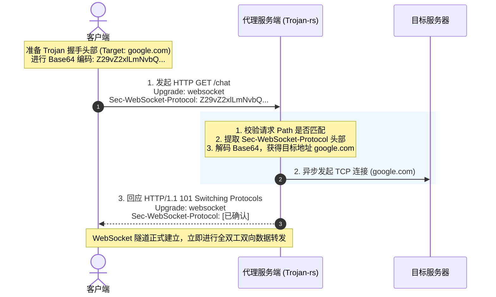
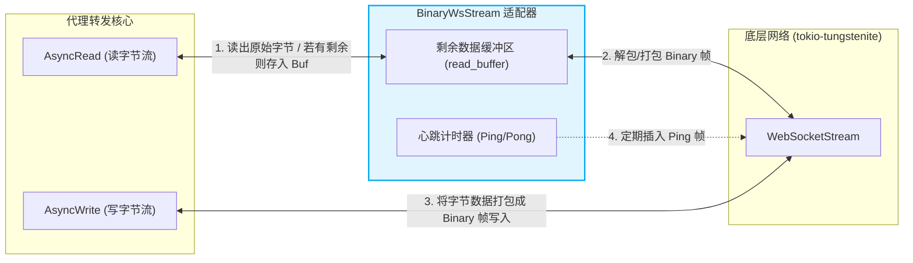

# 深入解析 WebSocket 协议 (RFC 6455) 隧道化与 0-RTT 优化

在现代网络代理中，**WebSocket (WS/WSS)** 是一种被广泛应用的传输协议。它不仅能够提供全双工、低延迟的双向通信，更重要的是它天生具备极强的**流量伪装特性**与 **CDN 兼容性**。

本文将深入探讨 WebSocket 在代理场景中的应用价值，详解 `trojan-rs` 中的握手校验、0-RTT Early Data 优化以及 `BinaryWsStream` 字节流适配器的实现。

---

## 一、 为什么在网络代理中使用 WebSocket？

### 1. 完美的 HTTP 兼容性与伪装
WebSocket 的握手阶段使用的是标准的 **HTTP/1.1 Upgrade** 机制。在防火墙（DPI）看来，这只是一个普通的网页应用在进行 WebSocket 通信（如网页聊天室、实时股票行情等），其流量指纹与普通 Web 应用无异。

### 2. CDN 中转（隐藏源站 IP）
这是 WebSocket 协议在代理中最重要的应用场景。普通的 TCP/TLS 代理流量（如裸 Trojan）不是标准的 HTTP 流量，无法通过 Cloudflare 等普通 HTTP CDN 进行中转。而由于 CDN 原生支持 WebSocket：
* **拓扑结构**：`客户端 -> 访问 CDN 节点 (HTTPS) -> CDN 回源 -> 代理服务端 (WSS)`
* **核心优势**：客户端只与 CDN 节点交互，代理服务端的真实真实 IP 被安全地隐藏在 CDN 后面。即使代理服务的 IP 被封锁，只需更换 CDN 域名即可恢复，极大提升了服务生存率。

---

## 二、 WebSocket 握手与 0-RTT 早期数据 (Early Data) 优化

### 1. 传统的 WebSocket 握手时延
标准的 WebSocket 连接需要经历两阶段：
1. **第一阶段**：TCP/TLS 握手。
2. **第二阶段**：HTTP Upgrade 握手。客户端发送 `GET` 请求，服务端回应 `101 Switching Protocols`。
3. 握手完成后，客户端才能发送代理协议头部（如 Trojan/VLESS 握手数据）。这多消耗了 **1 RTT** 的延迟。

### 2. `trojan-rs` 中的 0-RTT 早期数据优化
为了消除这 1 RTT 的延迟，`trojan-rs` 支持在 WebSocket 握手阶段直接携带代理协议数据（Early Data）。

* **原理**：客户端将首包代理数据（如 Trojan 的密码哈希及目标地址）进行 Base64 编码，放入 HTTP 握手请求的 Header（如 `Sec-WebSocket-Protocol`）或 URL Query 参数中。
* **效果**：服务端在收到 `GET` 请求的同时就解析出了目标地址并向目标发起连接，在回送 `101` 响应的同时即可开始转发数据，实现 0-RTT 建立代理隧道。

#### WebSocket 0-RTT Early Data 握手流程图

* **路径校验**：在 [src/protocol/websocket/acceptor.rs](file:///d:/dev/trojan-rs/src/protocol/websocket/acceptor.rs#L49-L87) 中，`WebSocketCallback` 会对请求路径进行严格校验（`websocket_path_matches`）。如果不匹配，直接返回 `404 Not Found` 丢给 Fallback 服务器，防止审查者进行路径扫描探测。

---

## 三、 字节流适配器：`BinaryWsStream`

网络代理的内核（如 TCP 转发）处理的是无边界的**字节流（Byte Stream）**，而 WebSocket 是基于**数据帧（Frame）**的协议。为了让上层转发逻辑能够无缝对接 WebSocket，`trojan-rs` 实现了一个适配器：[BinaryWsStream](file:///d:/dev/trojan-rs/src/protocol/websocket/mod.rs#L102-L110)。

`BinaryWsStream` 实现了 Rust 的 `AsyncRead` 和 `AsyncWrite` trait，将帧协议包装为流协议。

#### 字节流适配器工作原理

### 1. `AsyncRead` 的实现：解帧与缓冲
在 [poll_read](file:///d:/dev/trojan-rs/src/protocol/websocket/mod.rs#L120-L191) 中：
* **缓存优先**：首先检查本地缓冲区 `read_buffer` 中是否有上一次未读完的数据，如果有，优先拷贝给读取者。
* **接收新帧**：若缓存为空，调用 `poll_next` 接收底层的 WebSocket 消息。
  * 如果收到 `Message::Binary`，则提取其数据。若数据长度大于当前读取者的接收能力，则将剩余部分存入 `read_buffer` 以备后用。
  * 如果收到 `Message::Close`，则标记流已关闭。
  * 如果收到 `Message::Ping` 或 `Message::Pong`，直接忽略（底层会自动回应）。
  * 拒绝 `Message::Text` 等非二进制帧。

### 2. `AsyncWrite` 的实现：封帧发送
在 [poll_write](file:///d:/dev/trojan-rs/src/protocol/websocket/mod.rs#L194-L214) 中：
* 将应用层写入的字节数组拷贝封装为 `Message::Binary(Bytes)`，调用底层的 `start_send` 将数据作为二进制帧发送出去。

### 3. 心跳保活 (Heartbeat / Keep-Alive)
由于许多中间网络设备（如防火墙、路由器、CDN 节点）对闲置连接有严格的超时回收机制（例如 Cloudflare 默认 100 秒无数据传输会自动断开 WebSocket）。
* `BinaryWsStream` 内部集成了一个 `keepalive: Option<Interval>` 定时器。
* 在 [poll_keepalive](file:///d:/dev/trojan-rs/src/protocol/websocket/mod.rs#L260-L288) 中，每当定时器触发，它会主动向客户端发送一个 `Message::Ping` 帧，从而维持连接处于活跃状态。

---

## 四、 其他场景下的行业实践经验

### 1. HTTP/2 上的 WebSocket (RFC 8441)
传统的 WebSocket 必须基于 HTTP/1.1 进行 Upgrade，这意味着每个 WebSocket 隧道都需要占用一个底层的 TCP 连接。
* **先进技术**：RFC 8441 定义了**基于 HTTP/2 扩展 CONNECT 方法的 WebSocket**。
* **优势**：允许在同一个 HTTP/2 连接的多个 Stream 上并发运行多个独立的 WebSocket 隧道，将 HTTP/2 的多路复用与 WebSocket 的全双工报文完美结合，极大地节约了服务器的端口和连接资源。

### 2. 规避 CDN 限制与防封锁指纹
当使用 CDN 中转 WebSocket 流量时，需要注意以下防封锁要点：
* **避免大帧分片**：部分 CDN 对单个 WebSocket 帧的大小有限制。代理客户端应合理限制最大发送帧大小（如 `max_write_frame_size = 16 KiB`），避免发送过大的帧导致连接被 CDN 异常中断。
* **伪装握手 Header 顺序**：防火墙会分析 WebSocket 握手请求中 HTTP Header 的**顺序和大小写**。真实的浏览器（如 Chrome）发送的 Header 顺序是高度特化的。代理客户端在发起握手时，必须精确模拟现代浏览器的 Header 指纹，否则极易被 DPI 识别并阻断。

---
*本文档收录于项目的知识库建设，旨在帮助开发者深入了解基于 WebSocket 协议的安全隧道设计与优化。*
